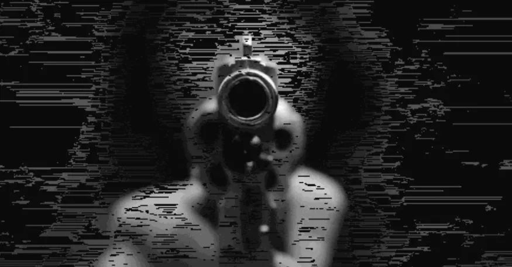
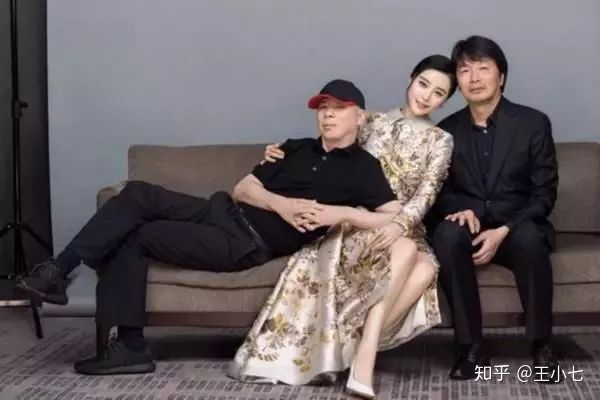
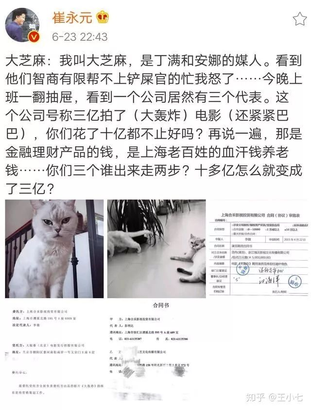
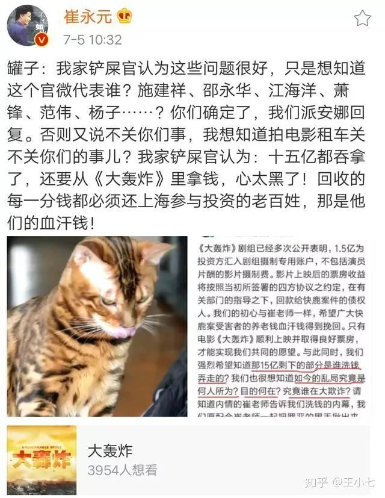
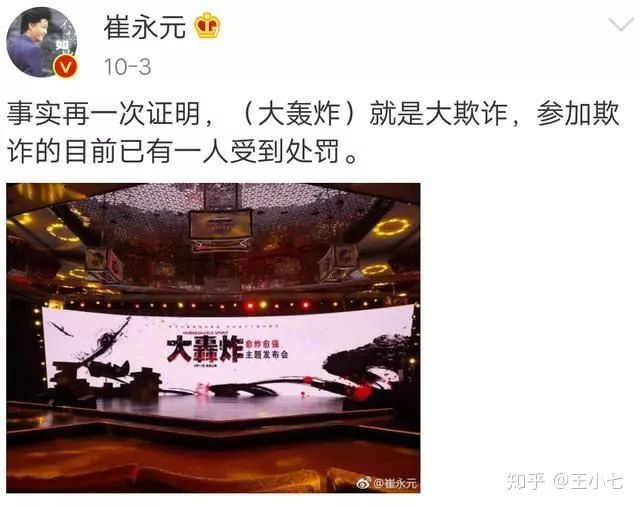
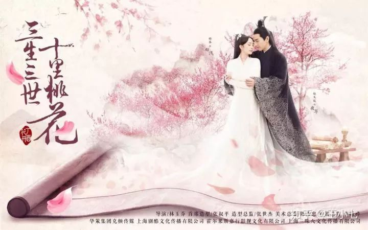
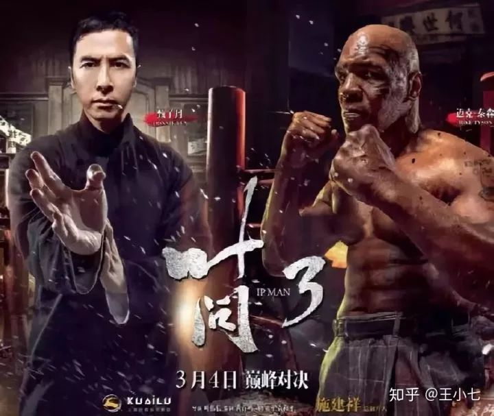
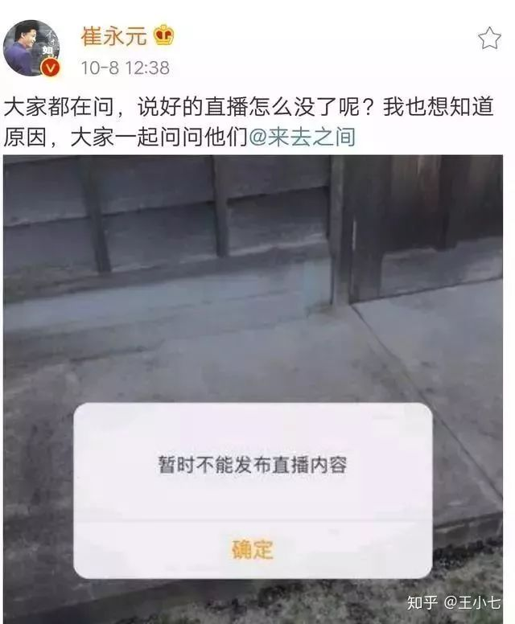
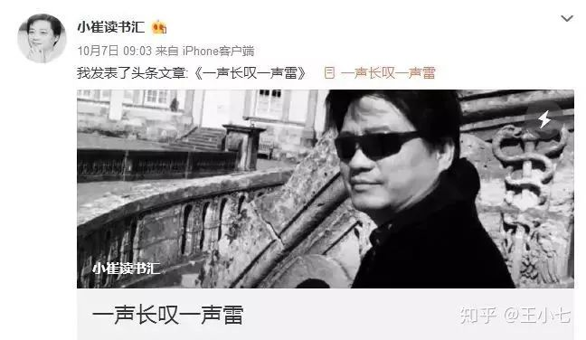
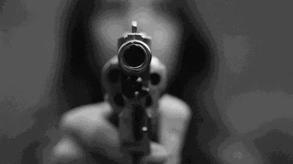

# “出头鸟”崔永元的死亡绝境 

 

这篇文在微信公号里刚发十分钟就被删了，虽然我已经被删掉这么多篇文章，这次被删还是很难过，有人说我写的文章太过真实，所以会被删。我不明白为何在如今的时代说真话是违禁品。不知道这里的什么时候也会被删掉，感谢阅读与支持吧。

 

根据群众的周期性遗忘规律，不久前还备受全国关注的崔永元曝光事件，此刻已经逐渐淡出了群众的视野，网民们甚至开始对范冰冰、崔永元、冯小刚等人的复杂纠葛厌倦起来。

<figure data-size="normal" style="margin: 1.4em 1em;">
 
</figure>

大多数人只是来看个热闹，排解一下生活的无趣，骂完某些明星不要脸之后，生活便回归平常，只是崔永元的生死之旅，才刚刚开始。

崔永元的生死之旅以炮轰冯小刚为起点，起初还只是处于两人撕逼阶段，而范冰冰阴阳合同的曝光则彻底将这一矛盾引爆，变成一场涉及数十亿偷漏税与洗钱活动的犯罪现场，并迅速蔓延至整个娱乐圈，华谊兄弟等各大影视公司都被牵扯进来，影视界行业大佬人人自危。

当时举国上下声援崔永元，册封崔永元为人民英雄，崔永元也如愿爆料的越来越多，引发整个娱乐圈地震，人人都道崔永元如何勇敢如何正义，却没人知道，此刻正名声鼎沸的崔永元，身后早已是万丈悬崖。

小崔不谈这些事情，我来告诉你现在的他究竟有多危险。

表面上看，崔永元只是曝光了一些娱乐圈明星、导演的偷漏税现象，但是暗中却几乎牵扯到所有行业大牛的利益。而范冰冰之类的明星，也只能算作是他们的赚钱手段而已，为他们的肮脏龌龊盖上一层靓丽外衣。

动了一整个行业、而且是富豪云集行业的奶酪，又怎么会只是简简单单邪不胜正的情节。现实生活中，多半是邪恶的一方才会笑到最后。

就简单拿崔永元曝光的电影《大轰炸》来说，一部电影就涉及到十几亿来头不明的资金，原定只有8000万投资，结果备案资料上显示电影成本3亿元，但真正的投资钱数却高达15亿多，其中牵扯到的富豪更是数不胜数：

<figure data-size="normal" style="margin: 1.4em 1em;">
 
</figure>
<figure data-size="normal" style="margin: 2.24em 1em 1.4em;">
 
</figure>

这几乎是赤裸裸的洗钱行为了：

<figure data-size="normal" style="margin: 1.4em 1em;">
 
</figure>

崔永元一下子把整个娱乐圈的糜烂现象都暴露了出来，几乎打断了某些业内大佬的洗钱途径，更揭示了当今中国市场为何烂片如此之多的一个重要原因：很大一部分都是洗钱者的功劳。

近年来的中国的影视剧一直有这样三个畸形现象：

1、观众没好片子看，每年垃圾烂片却大量生产;

2、影视剧投入越来越多，高质量影视剧却越来越少;

3、演员片酬越来越高，演员的演技却越来越差。

面对这种现状，善良的我们还以为是艺术本身出了问题，实际是很多影视剧投资商根本不在乎影视剧质量，只关心如何“洗钱”。

而洗钱的资金来源主要是资本市场及有关基金、股市。一些老板通过资本市场收到这些股民的钱，之后通过洗钱放进自己的口袋。

简单来说，就是悄悄地把老百姓的钱偷到自己口袋中。

而洗钱最高效的方式，就是拍电影、电视剧。

这些老板们拿到老百姓的钱之后，就开始随便选一个影片投资，摇身一变，成了投资商，然后付给经纪公司巨额报酬，经纪公司则暗中把大部分钱再转移给这些老板。

同时，这些“投资商”还会与拍摄制作公司达成协议，把来自资本市场的公共资金，仅一部分用于拍戏，另一部分则以拍戏制作为名目，转移到自己的代理人、代理公司手中。然后这些代理人、代理公司又会在暗中把大量资金转交给这些老板。

这样一来，那些原本来历不明的资金就有了名正言顺的由头，轻轻松松几亿元挣到手。

此外还有重要的一环，经纪人公司和投资制作公司，又会买通收视率统计机构和微博等大的舆论平台，不管多烂，都把这些为了洗钱而拍摄的影视剧推上热点，大力鼓吹，包装为高收视率热播剧。

这都是娱乐圈几乎做烂的事情了，比如《三生三世十里桃花》伪造点击量的事件，达到了夸张的一天15亿次。也就是说有7亿中国人每天要看两次这部剧。

 

<figure data-size="normal" style="margin: 1.4em 1em;">
 
</figure>

 

通过这些操作，这些影视就会有一个光鲜的收视口碑和业绩，欺骗市场，欺骗观众，也欺骗了影视的有关管理部门。

电影也是基本如此操作。只是协商对象不是电视台而是院线发行公司。

最典型的就是《叶问3》的上映：

<figure data-size="normal" style="margin: 1.4em 1em;">
 
</figure>

根据猫眼票房官方记录，《叶问3》首日票房1.55亿元，打破华语动作片首日票房纪录，随后成为最短时间突破3亿、4亿元纪录的华语动作片，上映5天就拿下6个亿的票房。

但是在《叶问3》上映期间，“幽灵场”现象频出，经常在午夜场、早场等冷门时段电影票售罄，但电影院里却空无一人；票价更是超出正常票价范畴，最高票价达到203元。

这明显就是投资商自导自演的一出戏，自己买票，最后自己收钱，然后把不正当的钱成功正当化，盆满钵满。

十几年来， 就是这么一个完整的资本幕后操作的利益黑链条，在中国影视娱乐圈运行着。所有的乱象和怪现象，由此都可以找到源头。

而崔永元则几乎一举打断了这个洗钱链条，把在娱乐圈里圈钱的大佬们的钱路几乎断掉，你说他在那些有权有势的洗钱大佬眼里，可恨不可恨？

估计他们早就恨不得把他碎尸万段了。

而那些还未被曝光的洗钱大佬呢？

要么赶紧转移资产，计划逃往国外；要么快刀斩乱麻，直取敌方首级——崔永元。

除却这些心怀鬼胎、势必会成为崔永元生死仇人的人，那些没有涉及到偷漏税乃至洗钱行为的行业大佬，也多半会站在崔永元的敌对面，即便不站其敌对面，也必然会敬而远之，绝不会主动跳进这一暗流涌动的漩涡中。

所谓常在河边走，哪有不湿鞋，没准哪天枪口就对准自己的脑袋了，就算自己一身正气不会行蝇营狗苟之事，但看到正义的那一边危机四伏，一步踏错就会跌进万丈深渊，娱乐圈大佬们一身金银哪个不惜命，躲都来不及，根本不会参与进去。

自古以来清官、正义卫士就不受顶层大牛待见，往往四面皆敌，就算不死，也会处处不顺，备受排挤。只有无权无势的底层百姓会爱戴这些清官，但千百年来的清官又有几个能够安享晚年，得以善终？

所谓清官两袖清风，多半寒酸穷寡，郁郁不得志，自古如此。

而那些各行业的大佬们，天然就有相互抱团的习性。

2008年三聚氰胺事件导致蒙牛股价暴跌，柳传志连夜召开联想控股董事会，48小时之内就将2亿元打到了老牛基金会的账户上，而新东方俞敏洪董事长闻讯后，二话没说，火速送来5000万元。分众传媒的董事长江南春也为老牛基金会准备了5000万元救急...... 2018年5月份联想爆出丑闻、被万人唾骂时，各界大佬也纷纷发声支持联想，就连我们一直观感颇好的马云雷军，也对柳传志加以声援，称“联想是民族产业的一面旗帜。”

因为精英阶层的人数本就格外稀少，站在高处的人最怕的就是有一天自己会突然坠落，所以都广交朋友，出了事故都希望别人能拉自己一把，那些总是在大佬圈中为自己树敌的人，多半出个大事件就阵亡了。

也就是说，在真正有权利的阶级中，崔永元几乎是孤军奋战，以一己之身对抗整个产业，前方是掌控权利与话语权的业界大佬，而左右则空空荡荡，无人愿意同行，后方是四处潜伏的暗刀暗剑，一招不顺就可能被哪个大佬所雇佣的几个要钱不要命的砍杀了。

而崔永元真正的支持者呢@·@

是我们这些屁大点权利都没有的草民，只能靠网络舆论声援，给予小崔精神上的鼓励。也就能安慰安慰小崔了，对于解决那些四面皆敌的状况屁用没有，照旧危机四伏。

非但如此，按照人民七天记忆的习性，早就慢慢准备把这个曾经维护他们利益的勇士抛至一边了。

也可能有人会问了：这些人偷漏税、洗钱跟我有半毛钱关系？我特么为啥要支持崔永元？

这些洗钱的投资商、影视公司拿着我们的钱，拍出屎给我们看，非但如此还把整个中国的社会环境搞的像个臭气熏天的茅坑，让每个人都不得不在里面吃屎，而崔永元在努力把我们从屎坑里捞出来，你说跟你有没有关系？

在崔永元的勇敢斗争中，我们才是最大的受益者，可我们正在遗忘这个曾为我们奋斗的勇士。

非但如此，崔永元能够与我们沟通的渠道都在被逐渐关闭。

10月8日，崔永元的微博直播途径被封禁，并且多条曝光偷漏税的消息被微博官方删除：

<figure data-size="normal" style="margin: 1.4em 1em;">
 
</figure>

这也就意味着崔永元能汲取到的支持将会前所未有地变小，那些掌权的利益受害者正在处心积虑地堵住崔永元的嘴。

等真的到所有大平台都被一些大佬买通，开始封杀崔永元所有言论渠道的时候，崔永元就真的沦落为孤身一人对抗千军万马了，说不定我们再次听到崔永元消息的时候，已经是通过新闻报道的悼念词了。

绝望至此的困境，聪明如小崔又如何看不出来，他曾经在微博中说，他已经收到了十多次死亡威胁，10度报警，甚至有人把威胁信从他家的门缝插了进去。

非但如此，某些本该保护正义者的警方，都开始呈现演变为凶手的可能：

10月7日上午，微博账号“@小崔读书汇”发布《一声长叹一声雷》文章。文章写到：

“上海公安局经侦大队对所有我参与的公司彻底侦察，对我以前的助理不断询查，彻夜询查。我知道原因在于（大轰炸）。参与这次大欺诈的既有演艺界大腕也有上海经侦的警察。曾经当着我的面，他们喝两万一瓶的酒，抽一千一条的烟，几十万的现金用个书包就提走。

<figure data-size="normal" style="margin: 1.4em 1em;">
 
</figure>

也因此，崔永元还曾多次声称自己绝对不会自杀。话中话就是如果自己死了，一定是被谋杀。

聪明如小崔，早就谙熟了世间正义者的人生路，因为那些曾经与他同行的勇士，早早就书写好了他未来的命运：

调查“疫苗乱象”第一人、有力的保障了每一个中国孩子的生命安全的王克勤，结果连同给自己签发疫苗报道的总编辑包月阳，被免职。  揭露地沟油的记者李翔，一生为人民健康奔波，结果在2011年9月18日凌晨1点，被刺杀、身中十余刀死亡。  揭露“三鹿奶粉三聚氰胺事件”的打假人蒋卫锁，甚至为了打假、为了老百姓能喝上健康的奶粉卖了企业，丢了老婆，两个孩子因此辍学。结果在2012年11月2日，被9人伤害致死，全身被刺数刀，最致命一刀刺于心脏，于11月14日下午不幸离世。

小崔或许早就心有所感，决意成为殉道者，所以他说“我的危险来自四面八方，但我要是把那良心丢了，我的病好了也无用。”

<figure data-size="normal" style="margin: 1.4em 1em;">
 

  <svg width="60" height="60" viewbox="0 0 60 60">
   <g fill="none" fill-rule="evenodd">
    <ellipse fill="#000" opacity="0.45" cx="30" cy="30" rx="30" ry="30"></ellipse>
    <ellipse stroke="#FFF" stroke-width="2" stroke-linecap="round" stroke-linejoin="round" stroke-dasharray="4,1,4" cx="30" cy="30" rx="26" ry="26"></ellipse>
    <svg x="16" y="18.5">
     <path d="M12.842 12.981V11.4H7.64v1.653h3.27v.272c-.018 1.881-1.442 3.147-3.516 3.147-2.382 0-3.876-1.846-3.876-4.834 0-2.936 1.485-4.79 3.832-4.79 1.732 0 2.936.835 3.428 2.364h1.977c-.43-2.566-2.522-4.201-5.405-4.201-3.55 0-5.845 2.601-5.845 6.644 0 4.096 2.268 6.654 5.863 6.654 3.322 0 5.475-2.083 5.475-5.327zM17.518 18V5.317H15.55V18h1.97zm5.142 0v-5.256h5.449v-1.74h-5.45V7.11h5.95V5.317h-7.918V18h1.969z" fill="#fff"></path>
    </svg>
   </g>
  </svg>

</figure>

但那是我们永远都不愿看到的结局。

我的力量弱小，也只能在这里写篇文章让更多人知道小崔的困境。心中愧疚万分，终究无可奈何。

所有的文字写在这里，只希望崔永元这个名字能被所有人铭记。

而这次争斗，我希望是正义笑到最后。

 

PS：大号被封杀了，我只能力所能及地把我存的一些稿件放在这里了，谢谢你的关注与陪伴。新朋友就关注这个账号吧。我们一起加油。

 **更新时间：2020-07-09 13:57:28**