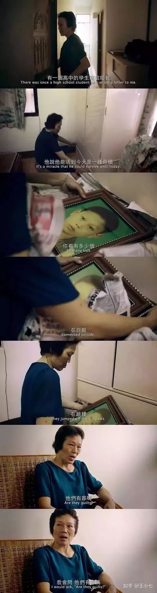

# 为了治疗娘炮病，家长又把孩子交给了恶魔“杨永信” 
前几天被一则新闻震惊了。 

<blockquote class="" data-type="2" data-url="" data-author-name="" data-content-utf8-length="89" data-source-title="">
 <section class="">
  <section style="margin-left: 1em;margin-right: 1em;">
   据报道，一些家长受到
   “娘炮毁灭中国”的号召，将自己的儿子，送到北京某训练营进行军事化训练，因为这些男孩过于羸弱、爱哭、胆小、文静；在家长和教练眼里，这场训练，叫做
   “消灭娘娘腔”。
  </section>
 </section>
</blockquote>
<figure data-size="normal" style="margin: 1.4em 1em;color: rgb(26, 26, 26);font-family: -apple-system, BlinkMacSystemFont, 'Helvetica Neue', 'PingFang SC', 'Microsoft YaHei', 'Source Han Sans SC', 'Noto Sans CJK SC', 'WenQuanYi Micro Hei', sans-serif;font-size: 15px;text-align: start;white-space: normal;background-color: rgb(255, 255, 255);">
 
</figure>

我特地去查了一下这个训练营，发现这个训练营竟然已经创办了六年，接纳了两万多名5到12岁的男孩，他们被要求接受摔跤等各种体能训练，甚至包括故意冷落和羞辱性质的内容：

<blockquote class="" data-type="2" data-url="" data-author-name="" data-content-utf8-length="38" data-source-title="">
 <section class="">
  <section style="margin-left: 1em;margin-right: 1em;">
   你是男孩子，一定要强壮和阳刚，不然就是不正常！
    
   你怎么这么娘！一点血性都没有！
  </section>
 </section>
</blockquote>

而每期训练营为期14天，费用高达6800元/人。

<figure data-size="normal" style="margin: 1.4em 1em;color: rgb(26, 26, 26);font-family: -apple-system, BlinkMacSystemFont, 'Helvetica Neue', 'PingFang SC', 'Microsoft YaHei', 'Source Han Sans SC', 'Noto Sans CJK SC', 'WenQuanYi Micro Hei', sans-serif;font-size: 15px;text-align: start;white-space: normal;background-color: rgb(255, 255, 255);">
 
</figure>

暂且不谈这个训练营本身是否违背人性，单谈其效果，21天才能养成一个习惯，你告诉我用14天就能直接改变孩子的一生？就此性格大变化身战狼？

14天里面，这些文静的男孩子能受到的，估计也就是那些可能会烙印一生的侮辱吧。

自此他们知道了，原来像自己一样文静的男生，是社会所不容的“娘娘腔”，是必须被消灭的国家害虫。

而这些被送去改造的男孩子，大多都是前段时期娘炮之争的受害者，那些呐喊者娘炮毁灭中国的道德卫士们，终于达到了自己的目的，开始心中喜滋滋乐悠悠。一批根本不想管孩子的父母，也终于找到了逃脱责任的机会：把孩子送去改造就好了，立马变成社会主义四好青年。

只是那些根本无法在14天改变性格的男孩，会在未来的十几年里，排斥并讨厌自己的性格，甚至可能受到校园霸凌。

看到这个改造男性的训练营，是不是觉得有点熟悉？

这和之前我们多次批判的，教女人要三从四德的女德班何其相似？

在东莞蒙正国学馆的“女德班”上，对男人“打不还手，骂不还口，逆来顺受，绝不离婚”被奉为女人的精髓，该女德班提出：“如果要做女强人，不好好在家相夫教子，你就得切掉子宫、切掉乳房，放弃所有女性特点。”

<figure data-size="normal" style="margin: 1.4em 1em;color: rgb(26, 26, 26);font-family: -apple-system, BlinkMacSystemFont, 'Helvetica Neue', 'PingFang SC', 'Microsoft YaHei', 'Source Han Sans SC', 'Noto Sans CJK SC', 'WenQuanYi Micro Hei', sans-serif;font-size: 15px;text-align: start;white-space: normal;background-color: rgb(255, 255, 255);">
 
 
（图:在女德班开课的拜师礼上,蒙正国学馆馆长黄城端坐于讲台上,接受学员们的叩拜）

</figure>

与前段时间的“娘炮毁灭中国”观点类似，这个女德班也率先占据了政治正确的道德高地，他们满怀责任感地大声疾呼：“一个有德行的女人，承载的是一个国家的命运！”

似乎道德卫士们都很擅长在讨论问题之前，就先占据“不这样做就会毁灭中国”的道德制高点，只是在面对两个性质类似的问题上，我们的态度截然不同，“女人不三从四德毁灭中国”几乎被所有人批判。

但“娘炮毁灭中国”则被多数人接纳，于是我在两星期前，发布那篇请求大家辩证看待娘炮现象的的文章中，遭到了接连不断的漫骂，咒我死全家都是轻的。

我发现很多中国人有一个特点，无论是父母还是社会，都特别喜欢按照自己的意愿决定别人的人生，看不惯你就是你的错，你不改就是道德败坏、危害国家的大害虫。

所以在我们国家中，女德班层出不穷，以至于现在开始演化出“男德班”。

我特地调查了一下这些总是呼吁或者是强迫自己孩子、妻子参加女德、男德班的人，发现了一个微妙的共性：他们的年龄大多是四十岁左右，也就是说，他们大多是七八十年代的人，但让我吃惊的是，这其中90后也不算少数。

为什么很多七八十年代的人总喜欢定义别人的人生？

<strong>（以下一段用图片表述）</strong>

<figure data-size="normal" style="margin: 1.4em 1em;color: rgb(26, 26, 26);font-family: -apple-system, BlinkMacSystemFont, 'Helvetica Neue', 'PingFang SC', 'Microsoft YaHei', 'Source Han Sans SC', 'Noto Sans CJK SC', 'WenQuanYi Micro Hei', sans-serif;font-size: 15px;text-align: start;white-space: normal;background-color: rgb(255, 255, 255);">
 
</figure>

而90后则是过度的一代，他们处于“抹杀个性时代”与“多元化时代”的交界处，是最挣扎最痛苦，也最矛盾最混乱的一代。

他们中一部分人受到旧一代父母的思想传承，成为新一代抹杀个性者，另外一部分则是因为眼界有限，只能看到自己四周的状况，自认为自己身边的小社会就是整个世界，于是看到别人和自己不一样就咋咋呼呼要消灭特例。

再加上高考制度的全面步入正轨，整个社会都变成了模式化工厂，高考占据了绝大多数人的人生，考试成为了整个社会关注的焦点，“如何做人、做自己”被抛掷一旁，集体化管理带来个性的严重缺失，人们按部就班的上学、毕业、结婚、生子、死亡。甚至连成功都被定义成“飞黄腾达”一种模式。

也因此，90后的一部分人严重缺乏基本人格，变成了三观残缺的思想残疾人。

于是他们认为顺从就是一切，与众不同就是社会毒瘤，必须抹杀，那些不一样的人必须变得和他们一模一样才算正常。

在这些思想残疾人的强烈呼吁下，杨永信和他的网瘾学校应运而生。

<blockquote class="" data-type="2" data-url="" data-author-name="" data-content-utf8-length="218" data-source-title="">
 <section class="">
  <section style="margin-left: 1em;margin-right: 1em;">
   08年的时候，杨永信以网瘾少年们的救世主的姿态，突然出现在公众面前。
    
    他先是在当地人口中传开，甚至上了央视《战网魔》纪录片，
   当时甚至连央视都间接成为了杨永信的后盾。那时候有关网戒中心有这样一段视频资料，展现了杨永信近乎神迹的戒网瘾效果：
    
    网戒中心里有一间13号治疗室，任何少年少女，无论之前多么不听话，怎样顶撞父母，怎样大声反抗。只要进了那个房间，40分钟后出来就会像换了一个人一样，百依百顺，声音轻的像蚊子哼，有的甚至当场向父母跪下认错。
  </section>
 </section>
</blockquote>

看到这种奇效的父母们欣喜若狂，即便自己的孩子没有网瘾，也都争相交上一大笔治疗费，想把孩子改造成自己想要的那种百依百顺的好孩子。 

让人吃惊的是，当时杨永信毫不讳言地表示自己使用的是“电休克治疗仪”，也就是说通过往孩子的太阳穴里通电来“治疗孩子”。

甚至在进行强迫性电击“治疗”前，杨永信都不会给孩子做任何身体检查。上来就电，电到你求饶，电到你屈服，电到你认同我，最后成为我的一部分。

但是家长们依旧趋之若鹜恨不得亲自把孩子送到电击台上：

<figure data-size="normal" style="margin: 1.4em 1em;color: rgb(26, 26, 26);font-family: -apple-system, BlinkMacSystemFont, 'Helvetica Neue', 'PingFang SC', 'Microsoft YaHei', 'Source Han Sans SC', 'Noto Sans CJK SC', 'WenQuanYi Micro Hei', sans-serif;font-size: 15px;text-align: start;white-space: normal;background-color: rgb(255, 255, 255);">
 
</figure>
<figure data-size="normal" style="margin: 2.24em 1em 1.4em;color: rgb(26, 26, 26);font-family: -apple-system, BlinkMacSystemFont, 'Helvetica Neue', 'PingFang SC', 'Microsoft YaHei', 'Source Han Sans SC', 'Noto Sans CJK SC', 'WenQuanYi Micro Hei', sans-serif;font-size: 15px;text-align: start;white-space: normal;background-color: rgb(255, 255, 255);">
 
</figure>

不仅如此，杨永信的“改变人生”学校里，还出没着大批不受管教、个性鲜明的成年人，这些人多半是被家长或者自己丈夫骗进去，没有任何网瘾，然后在杨永信的电击诊疗所里，被逼供说出自己有网瘾，并表示自己认错，要重新做人，对父母和丈夫百依百顺。

而这些学成出院的孩子或成人，多半有这两种结局：一部分会跪拜杨永信，感激涕零，彻底顺从，接受改变，开始喜欢上这里的生活，甚至开始讨厌还在反抗杨叔的人。

<figure data-size="normal" style="margin: 1.4em 1em;color: rgb(26, 26, 26);font-family: -apple-system, BlinkMacSystemFont, 'Helvetica Neue', 'PingFang SC', 'Microsoft YaHei', 'Source Han Sans SC', 'Noto Sans CJK SC', 'WenQuanYi Micro Hei', sans-serif;font-size: 15px;text-align: start;white-space: normal;background-color: rgb(255, 255, 255);">
 
</figure>

而另一部分，则会对送自己进来的人疯狂报复。

《东方早报》有一则报道称，当某位“学成归来”的学生回家后，他第一句话就是“我剩下的日子就是为了让你们痛苦。从此我不做任何事情，让你们断子绝孙。”

只是更让人震惊的是，在09年就被曝光的杨永信，就这样在千百万父母和道德卫士的拥护下，成功把“电击一下，孩子百依百顺”的生意做了将近10年，直至17年才彻底倒闭。

期间更是出现了诸如把学生殴打致死的南宁起航拯救训练营，让17岁的“问题少女”活活把自己摔死的郑州搏强新观念培训学校。

杨永信们成功通过自己的努力，毁掉了数十万孩子的人生，那些父母和道德卫士们也如愿以偿，这些与众不同的孩子终于被彻底抹杀，成为行尸走肉。

而在中国这片充满魔幻现实的土地上，从不缺乏杨永信们的身影，旧杨永信们刚被打压下去，新一批杨永信们就即将崛起。

在各种“娘炮毁灭中国”的呼声中，各地“纠偏”学校或将拔地而起，与众不同的孩子将受到校园暴力，更多孩子的一生将会被摧毁。或许下一则“10岁文静男童被家长强行药物矫正身亡”的新闻，就在路上。

就像纪录片《不一样又怎样》里面，那个因为因为言行举止温柔被说“不像男生、像女生”的台湾少年叶永鋕，他被老师说不正常，让他去看医生，被同学霸凌，15岁就离开了这个世界，学校却四处逃避责任，将叶永鋕的死亡掩盖成自杀的样子。

每每读到叶永鋕的故事，都会让我想落泪：

少时的叶永鋕，是一个很懂事的孩子，看到母亲劳累就为母亲做饭捶背，经常被邻里夸赞：

<figure data-size="normal" style="margin: 1.4em 1em;color: rgb(26, 26, 26);font-family: -apple-system, BlinkMacSystemFont, 'Helvetica Neue', 'PingFang SC', 'Microsoft YaHei', 'Source Han Sans SC', 'Noto Sans CJK SC', 'WenQuanYi Micro Hei', sans-serif;font-size: 15px;text-align: start;white-space: normal;background-color: rgb(255, 255, 255);">
 
</figure>

在小学三年级时，懂事的叶永鋕因为喜欢做女孩子做的事，被老师视为不正常，要求去看医生：

<figure data-size="normal" style="margin: 1.4em 1em;color: rgb(26, 26, 26);font-family: -apple-system, BlinkMacSystemFont, 'Helvetica Neue', 'PingFang SC', 'Microsoft YaHei', 'Source Han Sans SC', 'Noto Sans CJK SC', 'WenQuanYi Micro Hei', sans-serif;font-size: 15px;text-align: start;white-space: normal;background-color: rgb(255, 255, 255);">
 
</figure>

被老师视作不正常的叶永鋕，自然就成为同学们的排斥与攻击目标，他多次被同学殴打，终于，在一次群体欺侮活动中，他彻底倒在了血泊中，无法站起，而校方却为了逃避责任，在未报警的情况下就洗去叶永鋕的血污，营造成非他杀的假象：

<figure data-size="normal" style="margin: 1.4em 1em;color: rgb(26, 26, 26);font-family: -apple-system, BlinkMacSystemFont, 'Helvetica Neue', 'PingFang SC', 'Microsoft YaHei', 'Source Han Sans SC', 'Noto Sans CJK SC', 'WenQuanYi Micro Hei', sans-serif;font-size: 15px;text-align: start;white-space: normal;background-color: rgb(255, 255, 255);">
 
</figure>

在叶永鋕抢救无效身亡后，校方就造谣说是叶永鋕自己有病，导致自己身亡，叶永鋕母亲决意要找出杀人凶手，结果被早就谙熟类似校园欺凌案件的检察官告知，解剖也没用，这样的都被判无罪了：

<figure data-size="normal" style="margin: 1.4em 1em;color: rgb(26, 26, 26);font-family: -apple-system, BlinkMacSystemFont, 'Helvetica Neue', 'PingFang SC', 'Microsoft YaHei', 'Source Han Sans SC', 'Noto Sans CJK SC', 'WenQuanYi Micro Hei', sans-serif;font-size: 15px;text-align: start;white-space: normal;background-color: rgb(255, 255, 255);">
 
</figure>

自此叶永鋕的母亲彻底陷入伤痛之中，在事件被报道后，叶母变成了那些与众不同孩子的倾诉对象，她收到了无数封想要自杀孩子的信件，字字都是血泪：

<figure data-size="normal" style="margin: 1.4em 1em;color: rgb(26, 26, 26);font-family: -apple-system, BlinkMacSystemFont, 'Helvetica Neue', 'PingFang SC', 'Microsoft YaHei', 'Source Han Sans SC', 'Noto Sans CJK SC', 'WenQuanYi Micro Hei', sans-serif;font-size: 15px;text-align: start;white-space: normal;background-color: rgb(255, 255, 255);">
 
</figure>
<figure data-size="normal" style="margin: 2.24em 1em 1.4em;color: rgb(26, 26, 26);font-family: -apple-system, BlinkMacSystemFont, 'Helvetica Neue', 'PingFang SC', 'Microsoft YaHei', 'Source Han Sans SC', 'Noto Sans CJK SC', 'WenQuanYi Micro Hei', sans-serif;font-size: 15px;text-align: start;white-space: normal;background-color: rgb(255, 255, 255);">
 
</figure>
<figure data-size="normal" style="margin: 2.24em 1em 1.4em;color: rgb(26, 26, 26);font-family: -apple-system, BlinkMacSystemFont, 'Helvetica Neue', 'PingFang SC', 'Microsoft YaHei', 'Source Han Sans SC', 'Noto Sans CJK SC', 'WenQuanYi Micro Hei', sans-serif;font-size: 15px;text-align: start;white-space: normal;background-color: rgb(255, 255, 255);">
 
</figure>

叶永鋕被霸凌致死了，然后呢？

没有任何人为叶永鋕的死亡负责。只留下一个伤心欲绝的母亲和残缺的家庭，和无数仍旧挣扎在自杀边缘的孩子。

然后你现在告诉我，改变那些与众不同的孩子就是拯救中国？

你们到底是在杀人还是在拯救国家？

你们总说这些与众不同的人时毒瘤，到底谁才是毒瘤？

这些总想定义别人一生的道德卫士，心中哪有什么家国，图的只是自己一时的爽快，他们只是因为不理解与自己不同的存在，就要站在“不和我们一样就会毁灭中国”的道德高地，杀死那些与众不同的人，毒害更多与众不同的孩子，把社会搞得乌烟瘴气。

他们永远不知道，一个成熟而健康的社会，一个可以良性发展的社会，一定是包容多元的社会，一定是允许与众不同存在的社会，一定是以允许每个人都可以拥有做自己权利的社会。

一定是一个即便无法理解，但我仍然尊重你独特的社会。

我希望所有看到这篇文章的人，都可以树立这样的良性理念。

我知道写下这篇文章后，我一定会再次遭受泉涌般的辱骂，但我还是必须要为那些仍在否定自我、备受欺压、挣扎在黑暗中的人发声：你们没有错，错的是社会！

你们不是毒瘤，

那些总想定义别人一生的中国人，才是最大的社会毒瘤！

 

PS：大号被封杀了，我只能力所能及地把我存的一些稿件放在这里了，谢谢你的关注与陪伴。新朋友就关注这个账号吧。我们一起加油。

 **更新时间：2020-07-09 13:57:33**