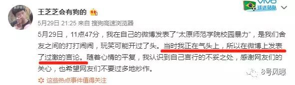
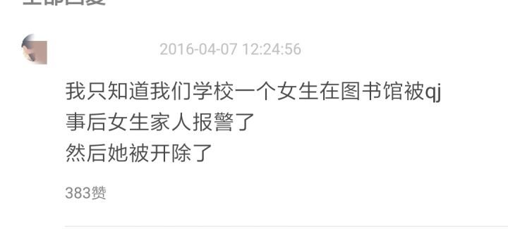

# 内幕|太原女生被施暴反道歉，这几个诡异细节让人后怕 
短短三天内，太原女生王芝芝就经历了“<strong>忍无可忍——绝望求助——主动道歉</strong>”的魔幻转折。

5月29日，太原师范学院的大二女生芝芝，在11点47分发出了一条长微博，自述她长达两年遭受室友霸凌的经历。

字里行间尽显绝望之情，一年来她受尽了学生的室友的欺侮，她被室友李梓瑶和赵湘取“潘金莲”的外号羞辱，被偷偷拍换衣服的视频，被强行扒下衣服拍裸照，裸照还被放在QQ群里共享，后来甚至被扣住双手、拳打脚踢。乃至最后患上了<strong>重度抑郁。</strong>

而后该事件迅速被顶上热搜，人们强烈要求学校对施暴者予以惩处。

可就在我们等施暴者的一个道歉时，<strong>受害者芝芝却先道歉了。</strong>

她称自己的言行不妥，室友没有对自己施暴，只是在打闹：

<figure class="Editable-styled" data-block="true" data-editor="dn8t" data-offset-key="7rbei-0-0" style="margin-left: 1em;margin-right: 1em;">
 

</figure>

似乎看起来这又是一个乌龙大反转。

可是我却发现了一些诡异的细节。

知友@种太阳的神对此细节作了详细对照。

芝芝一共发布过两次道歉，一次使用的是<strong>“搜狗高速浏览器”</strong>，而另一次使用的却是“<strong>三星Galaxy S10</strong>”。

<figure class="Editable-styled" data-block="true" data-editor="dn8t" data-offset-key="doie0-0-0" style="margin-left: 1em;margin-right: 1em;">
 

</figure>

而如果你翻看一下芝芝之前的微博，就会发现芝芝所使用的手机，一直只是<strong>“HUAWEI P10”</strong>。

<figure class="Editable-styled" data-block="true" data-editor="dn8t" data-offset-key="e54sd-0-0" style="margin-left: 1em;margin-right: 1em;">
 

</figure>

很明显芝芝只有一个手机，而在事发后，<strong>芝芝突然改换手机发布道歉，还接连转换两个发布方式。</strong>

显然，芝芝“<strong>并不是在正常状态下</strong>”发布的道歉。

那芝芝究竟是在什么状态下发布的道歉？答案已经显而易见。

我们甚至完全有理由怀疑，校方已经对其采取了<strong>“利诱”</strong>或者<strong>“威胁”</strong>手段。

我常年关注与剖析热点，看到的各种各样有关校园暴力事件太多了，在产生社会影响力较大的恶性事件时，相关学校第一时间想的多半不是解决问题，帮助受害者，而是直接抹除问题，撤热搜，删帖，息事宁人。甚至直接找一些自媒体带节奏，直接挖掘受害者黑历史，先把受害者抹黑再说。

几年前就一直有<strong>“被强奸=保研”</strong>的说法，不要觉得耸人听闻，这是真实存在的。

很多学校都被爆出存在<strong>“保研路”</strong>，因为在这条路上经常有学生被强奸。学校为了保全声誉，就会用保研名额进行利诱，要求被强奸者不要把事情搞大。

之前知乎还有一个答主因为不堪精神折磨，匿名分享过类似的经历：

她的一个室友就曾在被学校老师强奸后向她们哭求帮助，开始时她们都纷纷安慰她，义愤填膺地要带她去报警，讨还公道。

但就在她们准备去派出所报案的当天，学校领导就找到了她们，说只要她们不要把这件事情继续上报，就给她们全寝保研名额。

整个寝室一片沉默，很快，被强暴女生的室友就态度大变，开始劝她不要继续把这件事情搞大，不然对她自己名声不好，考研名额也没了，而且她们的名额也会被她搞丢。

在室友的轮番轰炸下，被强暴的女生最终选择不再上报警方，室友都满脸欣喜，而被强暴的女生在第二天傍晚割腕自杀。另外三个室友为了保全各自的名额，就对女生死亡原因闭口不言，最后事情不了了之。

当然，<strong>这种“有所补偿”的利诱，已经是比较好的结局了。</strong>

我更担心的是，被施暴的芝芝会不会不仅没有得到补偿，还被学校威胁了一番。

我一点也不希望我的担心会成为现实，<strong>但这种情况极有可能已经发生。</strong>

因为芝芝是否能继续上学、顺利毕业、取得毕业证书，全由校方把控，校方很有可能会用这些东西来变相威胁她。

这种推测并非空穴来风，很多网友都表示自己的学校曾采用过这种手段，比如豆瓣的一个朋友曾爆料，自己学校的一个女生被强奸，坚持报警，于是被学校开除：

<figure class="Editable-styled" data-block="true" data-editor="dn8t" data-offset-key="2l104-0-0" style="margin-left: 1em;margin-right: 1em;">
 

</figure>

而且在太原师范学院，已经<strong>有过“胁迫受害者”的先例：</strong>

事件爆出后，一名太原师范学院的校园暴力受害者，第一时间匿名回答了自己的遭遇：

<blockquote class="Editable-styled" data-block="true" data-editor="dn8t" data-offset-key="88cm5-0-0" style="margin-left: 1em;margin-right: 1em;">
 
同是太原师范学院的校园暴力受害者，今年大四，即将毕业。 

</blockquote>
<blockquote class="Editable-styled" data-block="true" data-editor="dn8t" data-offset-key="agkvp-0-0" style="margin-left: 1em;margin-right: 1em;">
 
也是在大二那年，我和一同班女生发生冲突，当时她便一把揪住我的头发，手直接上脸，并不时伴有<strong>脚踢肚子</strong>的行径。在事件爆发前、爆发后她和她的“小伙伴”<strong>四处冷嘲热讽，对我进行冷暴力</strong>。 <strong>事发后，自己第一时间报了警。</strong>

</blockquote>
<blockquote class="Editable-styled" data-block="true" data-editor="dn8t" data-offset-key="bttdh-0-0" style="margin-left: 1em;margin-right: 1em;">
 
但辅导员赶来后并<strong>没有第一时间安慰我</strong>，而是威胁说“只有两种选择：<strong>一警方介入，但后果是两人一视同仁都要拘留，并开除学籍；二是息事宁人握手言和。”</strong>

</blockquote>
<blockquote class="Editable-styled" data-block="true" data-editor="dn8t" data-offset-key="clagf-0-0" style="margin-left: 1em;margin-right: 1em;">
 
父母听后担心影响我的前途，当即表示原谅。

 
但我看到那个女生嚣张的一面后，不愿意一味忍让。翻遍校规手册，指出其中“打架者”条目中，率先出手滋事者应予以处罚一项，<strong>与系主任、书记据理力争，希望各位老师能还我公道</strong>，否则自己恐怕在这个学校已经无法生存.......&nbsp;

 
然后的结果就是，辅导员找来当时的目击者，在我不在场的情况下，<strong>引导他们说不利于我的“伪证词”。</strong>什么威逼利诱、冷嘲热讽、穿小鞋，我在短时间内统统领教了一遍……

</blockquote>

最后的结果呢？

施暴者嚣张离开，答主大三那年得了重度抑郁，休学回家后在家会突然情绪失控，崩溃大哭，使劲捶打自己的身体。

她悲伤地写道：

<blockquote class="Editable-styled" data-block="true" data-editor="dn8t" data-offset-key="69s97-0-0" style="margin-left: 1em;margin-right: 1em;">
 
<strong>那个内心哭泣的小女孩，永远不会笑了。</strong>

</blockquote>

两者情况何其相似，我们甚至可以说，这就是芝芝即将拥有的未来。 可是如果芝芝最终选择息事宁人，<strong>结果一定会更惨。</strong>

为什么会这么想？因为很明显，芝芝和上面这个女生的性格完全不同，这个女生第一时间就报了警，而且有和老师据理力争的韧性，而芝芝的性格明显更加内向怯懦。

她被施暴了这么多次，甚至到了被殴打，患上重度抑郁的地步才敢说出自己的痛苦，这是多么内向，多么害怕自己给别人添麻烦的孩子才会做的事情啊。

如果是我，肯定在第一时间就和施暴者硬刚上了。而芝芝却在这么多次被施暴之后，还选择沉默，她内心一定是极度胆怯的吧，能在网络上说出自己的酸楚，应该也是经过了巨大的心理斗争吧。

可是最终却迎来了“被迫道歉”的结果，芝芝面对这个局面，会有多么绝望和无助啊。

我真的特别心疼她，因为小时候的我，也是个内向怯懦的孩子，处处受欺负，受了欺负还被威胁，不敢说出去，小学一年级时，他们甚至把尿液灌倒塑料瓶里逼我喝，我哭着喝时，正好被来接我的爸爸撞见，他问我怎么了，我胆怯地低下头，不敢吭声，他拿过瓶子闻了一下，直接把瓶子摔在了那几个人身上，扇了他们每人一巴掌。

而后爸爸俯下身，轻声告诉我，<strong>“别害怕，要还击，天塌下来我给你顶着。”</strong>

我永远记得这句话，自那以后我不再怯弱，校园暴力也从此离我远去。

后来我明白，我是不可能通过忍耐解决校园暴力的，我的怯懦只会助长他们的嚣张气焰，他们只会越发变本加厉，直到有一天，他们满脸嚣张与风光，而我可能再也无法承受这种欺辱。

如果真的有这么一天，那时的我能怎么办呢？

我想，我只剩下三条路了吧，要么带着伤痛和抑郁，折磨自己一辈子，要么自杀，要么忍无可忍的爆发，拔刀把他们打成重伤甚至杀死。自己坐牢。

<strong>我不想要芝芝，更不想要任何人面临这样的结局。</strong>

我们说：<strong>“幸运的人，一生都被童年治愈，不幸的人，一生都在治愈童年。”</strong>

这不仅适用于原生家庭，更适用于校园暴力。

<strong>当恶不被遏制，就会吞吃沉默越发壮大</strong><strong>，终有一天它会吞吃掉所有光明，让绝望无处藏身。</strong>

但所有的绝望都是被施暴者的，他们会一辈子带着伤痛活着，而施暴者往往风光靓丽，因为他们从未经受折磨，他们只是绝望的传播者，他们甚至不会记得，原来自己还毁掉过这么一个人。

<strong>而芝芝现在需要的，只是一点点支持，一点点声援，一点点“天塌下来我们罩着你”的安全感。</strong>

<strong>对受害者的沉默，就是对施暴者的纵容</strong>，如果这次的结果真的是息事宁人，那势必会是一个极坏的典范，造成极坏的社会影响。

其他学校看到这样搞有效，或许也会在面临相似情况时威胁受害者——<strong>毕竟效果卓越还能保全声誉。</strong>

而其他被施暴者将再度被重击，因为他们无法看到自己可以战胜绝望的希望——<strong>你瞧，原来再怎么爆发，再怎么反抗，都是没用的啊，都是只能承受被侵害的结局啊。</strong>

我写下这篇文章，不仅想告诉芝芝，更想要告诉更多仍在校园暴力中沉默的孩子们：

“你们要勇敢起来，你们要向施暴者坚决说不，你们要勇敢回击，你们要相信自己的力量，更要相信我们的力量，我们都是你的后盾，你们要相信即便学校不给你公道，我们也会为你讨回公道！”

我还想用爸爸曾对我说过，改变了我一生的那句话，告诉所有还在“被施暴中沉默的”的孩子们：

<strong>“别害怕，要还击，天塌下来我们给你顶着。”</strong>

往期文章：

<a href="https://mp.weixin.qq.com/s@·@__biz=MzU5Mzc2NTI5NQ==&amp;mid=2247483705&amp;idx=1&amp;sn=bc1f3606bb8c100f19639ba5d320013f&amp;scene=21#wechat_redirect" target="_blank" data-linktype="2" style="text-decoration: underline;">世界灯火被永久封禁了，可我不服，我还不想认输。</a>

大号阵亡了，想看大号里之前关于<strong>“华为形势剖析”“中国教育真相”等深度解读的文章，请点击后台菜单栏“往期精选”。</strong>

 

<strong>PS：</strong>大号已经阵亡了，谢谢大家能关注回这个小号，<strong>新朋友和在大号里遗失的老朋友看到后，都记得要关注回这个号啊</strong>，希望能与你再次同行。

本来今天不准备写文章了，但这件事看得我太揪心了，必须要写，<strong>无论转发分享还是点赞，都要说声谢谢。</strong>

 **更新时间：2020-07-09 13:53:48**