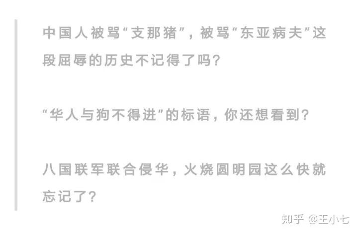
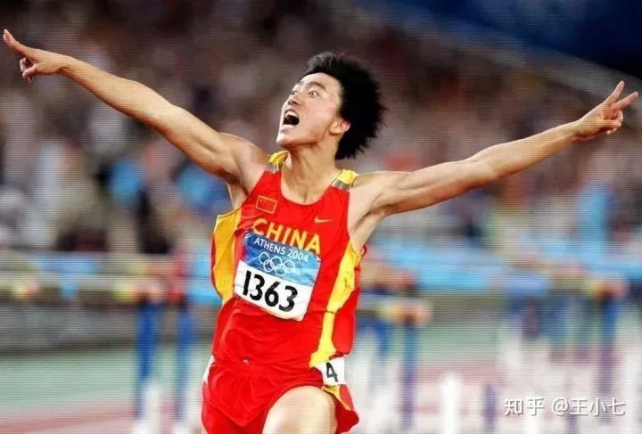

# 吴京被推上神坛，更像是一场聚众捧杀 

 

这几天吴京因为《流浪地球》大火，火到什么程度呢？

吴京数次登上微博热搜，而排名前四的知乎热搜，全部被《流浪地球》的相关话题占领，其中吴京一人就独占前四中的两个热搜席位。

<figure data-size="normal" style="margin: 1.4em 1em;">
 
</figure>

仅仅一周之内，公众号就生产出数十篇以吴京为主人公的爆文，百万级流量爆文像大白菜一样被收割。

至于这些在知乎、公众号里火爆的内容几乎如出一辙，全部都在说吴京如何如何伟大，如何如何值得赞美，这些文章、回答里绝不列举吴京任何瑕疵，反而会将吴京的所有行为都进行美化处理，看完这些之后我就知道——群众又在营销号的指引下开始造神了。

从夸吴京仗义耿直，到夸吴京有责任担当，到最后实在没得夸了，就把其他无关信息也扭曲一下拿来夸。

比如夸吴京拿6000万投资《流浪地球》是自愿，非常具有大无畏的奉献主义精神，值得学习。看得我格外尴尬，人家吴京是无偿贡献了6000万，还是在后期分红的时候准备一分钱不拿？

目前猫眼预测《流浪地球》票房50亿，而这部电影投资成本3.2亿，最后按照分红比例吴京拿个几亿不成问题。

当然，吴京的确对《流浪地球》的拍摄出了很大力气，这些钱也是他应得的，但是在拿出6000万投资《流浪地球》这件事情上，我只能说吴京是一个眼光独到的投资人，这一点从吴京几部投资的电影中也可见一斑。

吴京之前一共投资出演了3部电影，结果三部都大获全胜，而且其中两部都是现象级影片，《战狼2》票房高达56.79亿元，按照电影的分成政策，除去10余家电影投资人的收益外，吴京个人就可分得18亿元。

如果这次《流浪地球》最终破40亿票房，吴京很可能成为中国第一个票房破100亿的演员。

再比如直接用《流浪地球》里吴京的哭戏，把吴京的演技吹得神乎其技，堪称楷模教科书。但平心而论，吴京演技不错，可圈可点，在一线水平之上，但离神乎其技还有不小差距。

大概是因为娱乐圈流量渣滓太多，对比过于鲜明，大家看到一个演技还算不错的演员就大呼演技出神入化，看到彭于晏认真了点，在为电影疯狂练腹肌就要吹的不行，可这明明只是作为一个演员本身就需要有的、最基本的职业素养。

这还不算完，大家继续夸着夸着，又开始出现了某些奇怪的论调。

比如这篇在知乎上超过八千赞的文章：

<figure data-size="normal" style="margin: 1.4em 1em;">
 
</figure>
<figure data-size="normal" style="margin: 2.24em 1em 1.4em;">
 
</figure>

我通读了下全文，大致内容是：吴京这类才是真男人，代表着中国国运，娘炮毁灭中国，选择吴京就是选择未来。

关于这一点的反驳我不想再多说，好奇的可以参考我的这一篇文章：为了治疗娘炮病，家长又把孩子交给了恶魔“杨永信”。

再比如这篇在微信里流量过百万的爆文：

<figure data-size="normal" style="margin: 1.4em 1em;">
 
</figure>

文章先是夸了一番吴京，将美国和给《流浪地球》差评的人树立为敌对目标，将《流浪地球》、吴京和国家兴亡联系起来，然后强行强奸爱国情怀：

<figure data-size="normal" style="margin: 1.4em 1em;">
 
</figure>
<figure data-size="normal" style="margin: 2.24em 1em 1.4em;">
 
</figure>

一部电影，一个演员都能和国家兴亡、和爱国主义联系起来，不知道你们看着这些文章觉得如何，我是觉得挺尴尬的。

《流浪地球》这部影片在中国影视史上确实有划时代的意义，吴京确实是一个不错的演员，但这件事情如何又和国家兴亡挂上勾了？是中国太容易灭亡还是爱国这项生意太好上手了，谁都能嚎两嗓子捞点钱？

连各种尴尬的夸赞戏码都开始不断呈现，甚至成为百万爆文，可见吴京正在火速被捧上神座。但一个并不是神的人，只要站在一个本就不属于自己的高处，就注定要坠落，没有例外。

看似这些营销号们在吹捧吴京，在为吴京造势，但在我看来这更像是对吴京的一种消费，是一场变相的聚众谋杀。

因为吴京所经历的这些，早就有两个人替他走过了一遍。并且早就为他预演了一次未来。

投资并出演了一部里程碑意义的影片、票房大获全胜、被夸上云端打造成神，看到这些元素，是不是觉得有点似曾相识？

这一切，就是刘翔的曾经。

2006年，刘翔在在瑞士洛桑田径超级大奖赛中，一举以12秒88打破了保持13年的世界纪录夺冠，当时举世欢腾，全中国上下激动不已，很多中国人都热泪盈眶。

刘翔的这一跑打破了几十年中国人永远无法登顶跨栏赛的魔怔，被媒体称为“中国速度”，被万人奉为中国骄傲。

<figure data-size="normal" style="margin: 1.4em 1em;">
 
</figure>

然而就在仅仅两年后，08年奥运会上，刘翔因跟腱断裂无法继续比赛，只好落寞转身离去，万众瞩目，他失落痛苦到甚至未曾对大家挥手再见。

<figure data-size="normal" style="margin: 1.4em 1em;">
 
</figure>

但是让我没想到的是，他迎来的不是大家的安慰，而是近乎恶毒的指责：

“你在哪里丢人不好，非要在这里丢国家的脸！” “咱们交税不是为了养了一个废物！刘翔的小算盘就好他脸上的坑相同多！” 甚至当场有体育评论员声斥刘翔“要是我，我甘愿坚持走完，在规矩答应的情况下，慢慢地将10个栏一一推倒，直到走过结尾！”

直到12年伦敦奥运会刘翔万众瞩目，却再次失足，坠落而下：

<figure data-size="normal" style="margin: 1.4em 1em;">
 
</figure>

这次刘翔终于“学聪明”了，在摔倒后他拼了命，终于单脚跳到终点，吻别栏架，转身离去。

<figure data-size="normal" style="margin: 1.4em 1em;">
 
</figure>

结果又被指责作秀，被辱骂商业炒作，不要脸，是国家的罪人、民族的败类。

两次带伤上阵，输了奥运，就被全中国喷成了狗屎。

没有人在意刘翔曾拿过36个冠军，1次打破世界纪录，1次跑平世界纪录，5次打破亚洲纪录，3次打破亚运会纪录。

更没有人在意如今这个被他们骂成狗屎的人，就是曾被他们誉为“中国骄傲”的男人。

而吴京，就正在经历刘翔职业生涯的前半段。

就算中国人性情大变，即便在吴京电影出演失败后也能够冷静评论，不会重演墙倒众人推的局面，这场被万人赞誉成神的场景，依旧会是吴京的一次重大人生危机。

人在过度的赞誉面前很容易迷失自我，六小龄童就是他的前车之鉴。

当初六小龄童和吴京的境遇何其相似，都是因为一部剧大火全国，被万人封神。

本以为六小龄童会再出精品，但自一部《西游记》后，六小龄童就彻底一蹶不振，沉迷于国人的赞赏之中，一直消费西游记，消费吴承恩，消费粉丝，不断用西游记的形象拍广告收智商税，甚至自己又署名写了一部西游记，连吴承恩故居都打上自己的名头。

<figure data-size="normal" style="margin: 1.4em 1em;">
 
</figure>
<figure data-size="normal" style="margin: 2.24em 1em 1.4em;">
 
</figure>

结果最后受到批评后还倚老卖老，自以为才华横溢，不肯承认现实，到处打官司壮告那些批判自己的人，最终在2018年几乎被所有人讨伐，彻底从神坛跌落深渊，碎的连渣都不剩。

吴京也恰好在经历六小龄童职业生涯的前半段。

在李诞被万人吹捧时我就曾写道：任何将一个人神化的行为都是非常危险的，假如之后这个人做了什么违反众意的事情，那现在他有多辉煌，将来他就有多苟且。

所以即便你再爱他，也不要试图把他打造成一个完美形象，神是不能犯错的，但人可以。

在这个世界上，没有任何人可以被封神，吴京也只是普通人，也有缺点，他值得被夸赞，但真受被不起被全网尬吹。

如果你是吴京的忠实粉丝，请你理性对待吴京，如果你只是跟风吹一把吴京，还请善良一些，适可而止。

谁又能保证，下次吴京事发之后，不会成为下一面被众人推倒的墙呢？

即便不会被推倒，谁又能保证，吴京不会自我沦丧至虚荣深渊呢？

而吴京，究竟是成为下一个被喷成狗屎的刘翔，还是成为被众人骂成渣滓的六小龄童。

一切都取决于你此刻的选择。

 

PS：大号被封杀了，我只能力所能及地把我存的一些稿件放在这里了，谢谢你的关注与陪伴。新朋友就关注这个账号吧。我们一起加油。

 **更新时间：2020-07-09 13:58:25**