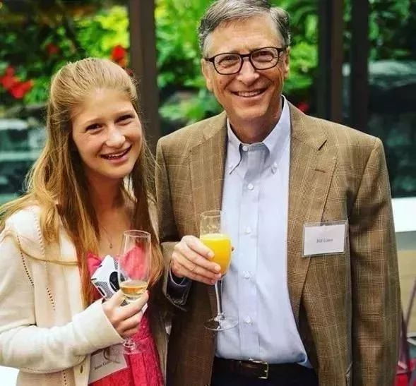

# 在被抖音轰炸死之前，你还差多少空虚? <h2 style="font-variant-numeric: inherit;font-variant-east-asian: inherit;font-weight: 600;font-stretch: inherit;font-size: 1.2em;font-family: -apple-system, BlinkMacSystemFont, 'Helvetica Neue', 'PingFang SC', 'Microsoft YaHei', 'Source Han Sans SC', 'Noto Sans CJK SC', 'WenQuanYi Micro Hei', sans-serif;clear: left;color: rgb(26, 26, 26);text-align: start;white-space: normal;background-color: rgb(255, 255, 255);margin-left: 1em;margin-right: 1em;margin-bottom: 25px;line-height: 1.75em;" data-mpa-powered-by="yiban.io">一、</h2>

前几天抖音出了一个“爆视频”，单单评论数就超过一百万，播放数量过千万。

这几乎是我们这些文字工作者难以企及的数量。而数量背后，潜藏着一个个为此付出时间与精力的人。

<figure data-size="normal" style="margin: 1.4em 1em;color: rgb(26, 26, 26);font-family: -apple-system, BlinkMacSystemFont, 'Helvetica Neue', 'PingFang SC', 'Microsoft YaHei', 'Source Han Sans SC', 'Noto Sans CJK SC', 'WenQuanYi Micro Hei', sans-serif;font-size: 15px;text-align: start;white-space: normal;background-color: rgb(255, 255, 255);">
 
</figure>

除此之外，相信你在朋友圈也看到过不少这样的话：“中了抖音的毒”、“刷抖音根本停不下来啊啊啊，一看表竟然刷了三个多小时......”

这一点相信刷过抖音、亦或者是刷过快手、火山小视频等等各种小视频软件的人都会深有感受。

如果你在路边、休息处看到一个人手指连动笑的合不拢嘴，那大概就是在刷小视频了。

我们会不自觉的深陷其中，蓦然之间发现时间已经过去了几个小时。

但是在笑容背后，我看到的不是快乐。

而是无尽的空虚与被绑架的思考。

赫胥黎在《美丽新世界》里面曾言：“人们感到痛苦的不是他们用笑声取代了思考，而是他们不知道自己为什么笑以及为什么不再思考”

而我们正在爱上这些使我们丧失思考能力的工业技术。

抖音、快手、抖音、微博这些软件正在飞速地强化我们对新奇事物的需求度，并拉高我们的敏感度。

同时降低的就是对文字的需求度与耐心度。

刷多了抖音、快手、微博这些软件之后，我们就会形成一种惯性：没有耐心去读一本长文或者书籍。更没有时间去思考，因为我们总是在期待着下一个引爆眼球的新奇事物，等待着它在视频中直接了当的呈现。

比如你就有可能看不完我的这篇长文。

而在被轰炸多了之后，我们就会逐渐爱上这种“被喂食”的感觉。

而当“被喂食”形成一种习惯之后，我们的就会惰于思考，耐心以及深挖问题的能力就会被逐渐抹杀。

还记得盛大公司吗？

<figure data-size="normal" style="margin: 1.4em 1em;color: rgb(26, 26, 26);font-family: -apple-system, BlinkMacSystemFont, 'Helvetica Neue', 'PingFang SC', 'Microsoft YaHei', 'Source Han Sans SC', 'Noto Sans CJK SC', 'WenQuanYi Micro Hei', sans-serif;font-size: 15px;text-align: start;white-space: normal;background-color: rgb(255, 255, 255);">
 
 
陈天桥

</figure>

这是一家十分“传奇”的公司，2001年年底，盛大账面上只剩下大约30万美金，陈天桥倾囊而出，买下韩国一款二线游戏《传奇》的中国代理权。

2002年，《传奇》同时在线人数突破60万，成为当时世界上最大规模的网络游戏，盛大月均销售额超过千万，市场占有率超过六成。

但是陈天桥在接受记者采访时却不止一次说过：“我从来不玩《传奇》，因为这是个烂游戏，浪费我的时间，但是盛大是个好公司”

但是不可否认的是，这个备受追捧的烂游戏确实吸来了千万销售额。

看到了么？你每时每刻傻呵呵的沉浸其中，换来的都是经营者的盆满钵满。

<h2 style="margin: 2.33333em 1em 25px;font-variant-numeric: inherit;font-variant-east-asian: inherit;font-weight: 600;font-stretch: inherit;font-size: 1.2em;font-family: -apple-system, BlinkMacSystemFont, 'Helvetica Neue', 'PingFang SC', 'Microsoft YaHei', 'Source Han Sans SC', 'Noto Sans CJK SC', 'WenQuanYi Micro Hei', sans-serif;clear: left;color: rgb(26, 26, 26);text-align: start;white-space: normal;background-color: rgb(255, 255, 255);line-height: 1.75em;">二、</h2>

“不知道为什么，刷抖音的时候感觉那么开心，可是刷完之后却分外空虚，变得很丧，而且更自卑了”一个粉丝在凌晨一点多私信我。

他说他刚在床上刷完抖音，然后就失眠了。

在孤寂无人的夜晚，我们最容易感受到自己的无助与空虚。

我回复说：“因为你爱上了一个虚拟且充满新奇G点世界，但是你依旧碌碌无为，你的生活仍然平平无奇。”

我称抖音、火山小视频、今日头条、快手等等以算法推荐为内核的软件为：毒品软件。

而算法会根据你的搜索、浏览等各种信息汇总出你最感兴趣的东西，随后在这个模块对你轮番轰炸，让你在自己喜欢的领域内迅速找到G点，然后高潮不断。

他会让你不知觉间沉迷其中，并且在你发觉已经浪费了几个小时时间之后，提醒你：“我再刷最后一个，就最后一个”然后又过了几个小时。

但人的精力、时间是有限的，当你选择了虚度时光，你就没有更多精力去提升自己。

在这个被娱乐塞满的世界里，当没有足够强大的自控力时，我们就会因为沉迷各种诱惑而“被碌碌无为”。

比尔盖茨曾在采访中说过，他认为13岁是孩子拥有第一部手机的合适年龄。

<figure data-size="normal" style="margin: 1.4em 1em;color: rgb(26, 26, 26);font-family: -apple-system, BlinkMacSystemFont, 'Helvetica Neue', 'PingFang SC', 'Microsoft YaHei', 'Source Han Sans SC', 'Noto Sans CJK SC', 'WenQuanYi Micro Hei', sans-serif;font-size: 15px;text-align: start;white-space: normal;background-color: rgb(255, 255, 255);">
 
 
比尔盖茨和女儿

</figure>

他、珍妮弗、以及1999年出生的儿子罗里·盖茨都是在过了13岁生日后才被允许使用手机，小女儿菲比则在期待着13岁生日时得到自己的第一部手机。

“我们家把13岁定为得到手机的年限。”盖茨说，鉴于这项规定，孩子们从学校回家后常向他抱怨说，“其他孩子都有手机，我是唯一一个没有手机的人，这令人尴尬”。

除此之外，乔布斯还限制家里孩子玩ipad。

但是我们看到的是电子产品正在飞速低龄化，抖音快手已经迅速占据了小学生的生活。

而因为缺乏自制力，他们会沉浸其中无法自拔，在最应当拼搏的年纪里选择安逸，在价值观形成之际被灌输进大量的光怪陆离与不正之风。

于是他们开始模仿，追逐着未成年怀孕风当宝妈、跟着小青年跳社会摇、以为低胸博眼球就能赚大钱......当管制不利时，堕落便自此开始。

那些我们所热爱的东西，正在一步步把我们连根拔起。

<h2 style="margin: 2.33333em 1em 25px;font-variant-numeric: inherit;font-variant-east-asian: inherit;font-weight: 600;font-stretch: inherit;font-size: 1.2em;font-family: -apple-system, BlinkMacSystemFont, 'Helvetica Neue', 'PingFang SC', 'Microsoft YaHei', 'Source Han Sans SC', 'Noto Sans CJK SC', 'WenQuanYi Micro Hei', sans-serif;clear: left;color: rgb(26, 26, 26);text-align: start;white-space: normal;background-color: rgb(255, 255, 255);line-height: 1.75em;">三、</h2>

抖音这类短视频软件还有一个大功效，就是通过碎片化信息轰炸，让我们对现有世界的认知产生巨大偏离。

我们看到视频里面满是漂亮小姐姐和帅气小哥哥，就觉得世界上好看的人居多，然后拿起镜子一看：“我特么怎么这么丑”，然后变得更自卑，亦或者毅然决然去整容。

我们看到年入百万一抓一大把，就觉得身边人都是土豪，查查银行存款：“特么我还欠着花呗和京东白条”，然后觉得自己更加无能。

我们看到一些大佬技能眼花缭乱，心中一动也想掌握此门技艺，然后在刷下一个视频的时候就把刚刚的想法抛在脑后，酸溜溜地赞叹“我要是也能这么牛X该多好啊”

而在“被动”生成太多的丧能量之后，我们就会逐渐放弃自己，长出自己最不愿变成的庸碌面孔。

我们常说知识改变命运，但碎片化信息毁灭人生。

睡前抖音熬半宿，早上头条看世界。 有钱淘宝快剁手，没钱鸡汤补励志。 情绪不错发自拍，心里不爽有咪蒙。 每条推送都震惊，每个消息都刚刚。 全家微信学养生，好友全在拼多多。

好笑吗？

别着急笑，等你逐渐在碎片化信息世界迷失的时候，这就是你的人生。

一边刷小视频一边嫌时间太少，

一边感慨时光易逝一边虚度时光，

一边熬夜一边求不要猝死，

一边碌碌无为一边梦想年入百万。

不要被你所热爱的事物毁灭。

 

PS；大号被封杀了，我只能力所能及地把我存的一些稿件放在这里了，谢谢你的关注与陪伴。我们一起加油。

 **更新时间：2020-07-09 13:57:43**