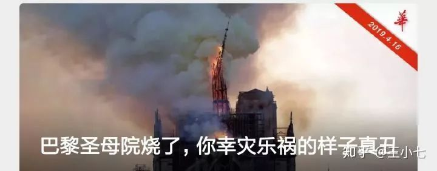
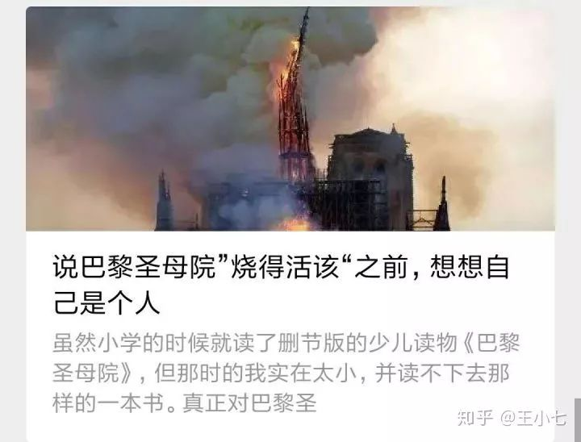

# 抱歉，对巴黎圣母被烧，我只能做到惋惜 
今日巴黎圣母院被烧新闻刷屏。

但看完各大公众号的内容后，我感到奇怪。

在我关注的上千个公号中，99%的文章都是同一个内容：义愤填膺地咒骂那些幸灾乐祸者，称其不配谈巴黎圣母院。

比如：对不起，你根本不配谈论巴黎圣母院

<figure data-size="normal" style="margin-top: 1.4em;margin-bottom: 1.4em;color: rgb(26, 26, 26);font-family: -apple-system, BlinkMacSystemFont, 'Helvetica Neue', 'PingFang SC', 'Microsoft YaHei', 'Source Han Sans SC', 'Noto Sans CJK SC', 'WenQuanYi Micro Hei', sans-serif;font-size: medium;text-align: start;white-space: normal;background-color: rgb(255, 255, 255);">
 
</figure>

巴黎圣母院烧了，你幸灾乐祸的样子真丑

<figure data-size="normal" style="margin-top: 1.4em;margin-bottom: 1.4em;color: rgb(26, 26, 26);font-family: -apple-system, BlinkMacSystemFont, 'Helvetica Neue', 'PingFang SC', 'Microsoft YaHei', 'Source Han Sans SC', 'Noto Sans CJK SC', 'WenQuanYi Micro Hei', sans-serif;font-size: medium;text-align: start;white-space: normal;background-color: rgb(255, 255, 255);">
 
</figure>

说巴黎圣母院“烧得活该”之前，想想自己是个人

<figure data-size="normal" style="margin-top: 1.4em;margin-bottom: 1.4em;color: rgb(26, 26, 26);font-family: -apple-system, BlinkMacSystemFont, 'Helvetica Neue', 'PingFang SC', 'Microsoft YaHei', 'Source Han Sans SC', 'Noto Sans CJK SC', 'WenQuanYi Micro Hei', sans-serif;font-size: medium;text-align: start;white-space: normal;background-color: rgb(255, 255, 255);">
 
</figure>

好像哀悼巴黎圣母院成为了政治正确，强烈哀悼就是精神贵族。

而不哀悼，亦或者心里面有所窃喜、反响冷淡就是面目丑恶，不配谈巴黎圣母院，思想低级。

在这场悼念之争中，两派鲜明分立，似乎整个中国都在争论要对巴黎圣母院表示强烈哀悼，还是要幸灾乐祸。

而真正的大多数群体却被忽略：他们并不感到难过，只是感到惋惜，也仅此而已。

这也是我的态度。

让我感到奇怪的是，在这场是否哀悼的争论中，有必要这么势不两立么？有必要非要通过为巴黎圣母院挤几滴眼泪来证明自己品格高贵么？有必要给无动于衷者扣一个思想低下的大帽子么？

在我看来，悲不悲伤，难不难过。只是站的的角度不同，立场问题，不应该互相苛责，从没有高下之分。

哀悼者在哀悼什么？

他们说：巴黎圣母院承载了太多的文化与回忆，比如雨果的伟大作品《巴黎圣母院》，它还影响了许多后世的创作，承载全世界无数人的念想和情愫，艺术是世界的。

幸灾乐祸者在开心什么？

圆明园被英法联军烧毁，苍天饶过谁？虽然对古董被毁感到可惜，但内心深处仍旧平衡了快意。

<figure data-size="normal" style="margin-top: 1.4em;margin-bottom: 1.4em;color: rgb(26, 26, 26);font-family: -apple-system, BlinkMacSystemFont, 'Helvetica Neue', 'PingFang SC', 'Microsoft YaHei', 'Source Han Sans SC', 'Noto Sans CJK SC', 'WenQuanYi Micro Hei', sans-serif;font-size: medium;text-align: start;white-space: normal;background-color: rgb(255, 255, 255);">
 
</figure>

两者出发点各有不同，在我看来都能理解，都没有什么大的过错。嘲讽的态度可能确实有点过分，应该受到谴责，但也不至于被扣上思想低级，面目丑陋，是大清奴隶的帽子。

可当哀悼党大张旗鼓地开始猛踩不哀悼者的脸时，这场好好的哀悼都变味了，一股腥馊气。

为什么有的人选择不哀悼？

他们可能联想到了圆明园，想到了家国之痛，想到了英法联军，想到了历史书上看到过的苦难，想到了为国牺牲的勇士。愤怒压过了同情，心里滋生了窃喜。

他们可能觉得自己并没有办法对巴黎圣母院产生情感连接，因为他们既不是法国人，也没有钱去法国一览巴黎圣母院风貌，对巴黎圣母院的了解或许还停留在雨果的那本《巴黎圣母院》上，或许也只看过书名。而自己甚至还在与996抗争，为了生活愁眉苦脸。

很多人说：“在这场大火面前，我们不分国界！”

抱歉，无论哪场大火面前，从圆明园被烧到巴黎圣母院被烧，都是分国界的。

鲁迅曾在《而已集》的最后一篇《小杂感》中写道：

<section mpa-from-tpl="t">
 <section data-id="94709" mpa-from-tpl="t">
  <section style="width: 100%;" data-width="100%" mpa-from-tpl="t">
   <section mpa-from-tpl="t" style="background: url(&quot;https://mmbiz.qpic.cn/mmbiz_gif/b96CibCt70iaZVWLqKWYqToBBoLTeNc2NmkjKzNXvPpA9RuZkhnELwGqocSCgD9vvWqQ51pZc1oVmfcCYapXyT8w/640&quot;) left top / 6px repeat-y;">
    <section data-autoskip="1" style="font-size: 14px;text-align: justify;letter-spacing: 1.5px;line-height: 1.75em;color: rgb(63, 62, 63);padding: 0px 1em;" mpa-from-tpl="t">
     
“楼下一个男人病得要死，那间壁的一家唱着留声机；对面是弄孩子。楼上有两人狂笑；还有打牌声。河中的船上有女人哭着她死去的母亲。

     
人类的悲欢并不相通，我只觉得他们吵闹。”

    </section>
   </section>
  </section>
 </section>
</section>

人与人之间的相互理解尚且如此苦难，更何况这涉及到跨文化的国与国之间的理解？你指望着一场大火就让全世界人类突破人性局限？做梦吧。

而哀悼者呢？

他们可能读过《巴黎圣母院》，有着良好的知识修养，对巴黎有深刻的了解，或许还有充裕的资金去一览风情，有钱有闲有情怀，在生活里还可以为艺术高歌，感叹艺术是世界的。

这两方人有谁是罪不可恕的？有谁是应该被骂不配做中国人的？

所有的问题都是经济问题，所有的原因都是阶级原因，互相滋生怨恨不过是阶级割裂的表征罢了。

在我看来，真正应该被谴责的，是那群号整天想着如何扩大阶级割裂的营销号，永远站在一个占据道德制高点的多数群体里骂另外一个群体，一脸高尚，背地里却整天做着割韭菜，分化男女关系，宣扬消费主义与田园女权的勾当。

可能看到这里你会质疑了：幸灾乐祸者你也能理解？

理解不等于认同，理解的含义是：我明白了他们为什么会这么做，可能会对他们产生同情之类的情愫，但我不会选择这样做，也不认同这样的做法就是正确的。

我一直认为，理解是当下时代最稀缺的品质之一。人们被公众号之类的媒体牵着鼻子走，而公众号为了制造噱头就要割裂阶级，制造矛盾，以引爆情绪。

如此发展，人们就越发不愿意理解和自己不一样的人，阶级割裂越发扩大，可以预测的是，阶级分化最终甚至会导致人们觉得“对方已经不能称为人”的结果。因为他们根本无法理解对方的行为。

多一点理解，世界才会多一点温暖，少一些矛盾，割裂化只会让这个社会更加糟糕混乱。

如果你看到了这篇文章，我希望你能尝试着去理解，哪怕一点点，都是人性的进步。

那为什么多数人并不感觉悲伤，而只是惋惜？

因为无论对于人、动物还是事物，人对其的情感浓淡程度，都取决于该事物与人类联系的紧密程度。而联系的紧密度则决定人是否会为其感到悲伤。

所以你会对亲人的去世感到悲痛欲绝，而对无关者的去世只是略有伤感。

如果是故宫起火，我一定心急如焚，等待着灾情进度。

可如果金字塔被炸毁，我可能也仅仅只有惋惜罢了。

正如知友@这是小号所言：汶川大地震时，听着四川卫视主持人报的伤亡人数，屏幕里开始哽咽，坐在电视前的我也开始掉眼泪。直到现在，在b站刷到相关视频，还是控制不住眼泪。

可但我听到日本因为海啸引发大地震后，我没有悲痛，没有幸灾乐祸，只是无感。

一件事与人的联系程度不同，所能感受到的情感也不尽相同。

承认自己的本性没有什么卑劣的，不必总是害怕指责，总想着给自己披上一层高尚外衣。

没有人能完全超脱人性生存，没有谁就因为不哀悼就低人一等，那些对很多艺术品都有强烈共鸣的人，不过是因为他们对其了解的更多，联系更为深切罢了。

除此之外，当法国总统流着泪哀悼巴黎圣母院时，我感觉有一丝讽刺，哀悼无错，可法国的当权者可以为了一件艺术品哭泣，却从未为那些因一公升汽油张了几分钱而揭竿而起的黄背心们掉过一滴眼泪，甚至派警方镇压枪杀，相反，他们却取消了巨富税。

当法国总统又说要重建巴黎圣母院时，我也只是感觉：挺好的，但也仅此而已。因为我知道在法国，还有很多从圆明园抢走的东西并未归还，我对这些文物的情感连接更重，我更关心文物的归还问题，这份感情压过了我对其被烧的难过，但也不代表我就不会为之惋惜。

在这场悼念大会里，没有谁比谁更高尚。

你可以为法国感到难过，为世界失去这样一个伟大的建筑而惋惜。

但我还是要再次提到圆明园，我并不觉得自己思想低级，也不是为了引起国人共鸣哗众取宠，只是因为我从未忘记。

 

PS：大号被封杀了，我只能力所能及地把我存的一些稿件放在这里了，谢谢你的关注与陪伴。新朋友就关注这个账号吧。我们一起加油。

 **更新时间：2020-07-09 13:57:51**