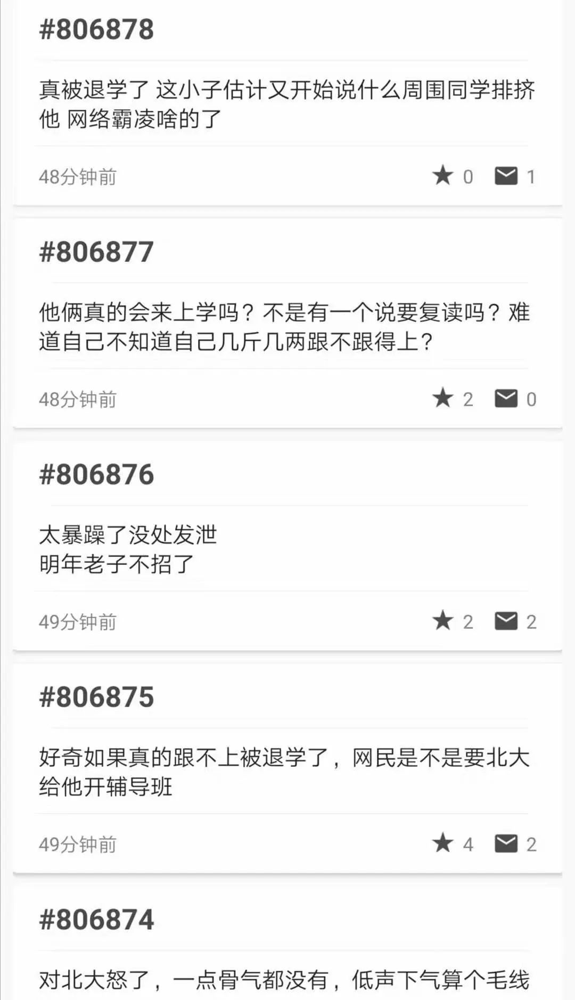
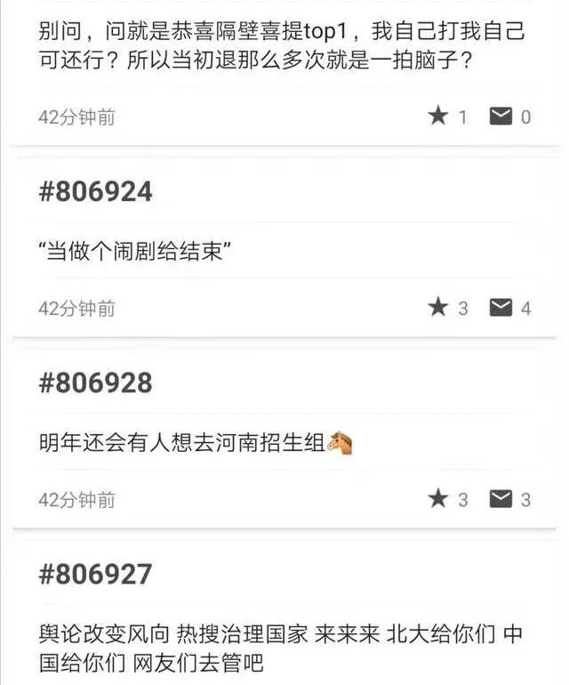
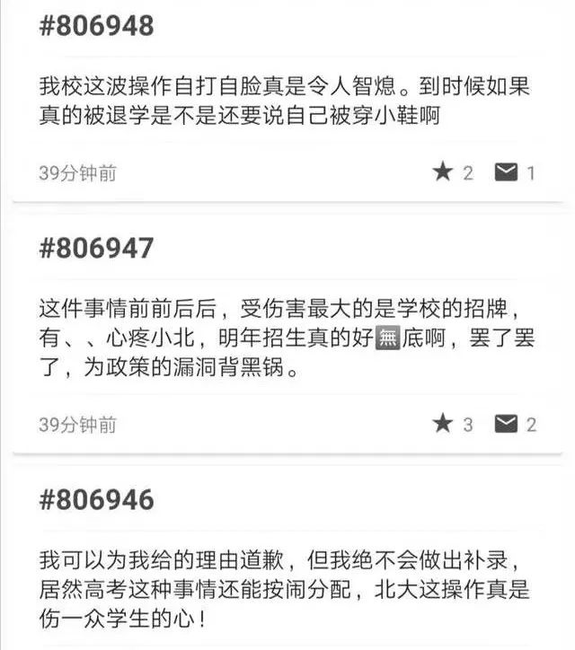

# 比北大三次退档河南考生更令人失望的，是某些北大学子的恶毒 
几日前，北大本着“以人为本，高度负责”的精神，为了不让原本已被录取的考生丢脸，不顾省教育考试院反对，三次坚持退档某河南考生，最后河南省考试院选择妥协，同意退档。 

而后该事件被顶上风口浪尖，漩涡中心的北大于8月11日撤回退档，补录已退档考生。

<figure class="Editable-styled" data-block="true" data-editor="98c5f" data-offset-key="7our3-0-0" style="margin-left: 1em;margin-right: 1em;">
 <section style="text-align: center;margin-bottom: 25px;margin-left: 1em;margin-right: 1em;">
  
 </section>
</figure>

我承认，该考生成绩确实差强人意，高考分数536分，距上一名差了一百多分。

但该考生分数完全符合录取要求，国家专项的规则是只要过了一本线就有资格报，只要在报考人里位次够高就能被录，而这个考生不过是按规则报了北大的专项计划，排名与分数也都符合要求，无一违规条件，<strong>北大又有何权利退档该考生？</strong>

北大不遵守社会契约，肆意践踏高考规则，退档理由“考生入校后极有可能被退学”尽显傲慢，更为其他大学做了一个最坏的榜样：<strong>“原来只要我们对考生不满就能随意退档”。</strong>

错在北大，这无可争议，我们总不能去怪那个完全按照规则报考的考生。

北大践踏规则确有其事，该考生分数不高也是事实，最终北大的补录举措也算两全其美。<strong>只是让我没想到的是，某些北大学子竟然如此恶毒。</strong>

在北大补录消息发送后，北大两个匿名论坛之一的树洞就开始涌现一种声音：“又穷酸又恶臭的中国网民舆论绑架北大，该白莲花考生不配上北大，如果让这些叫嚣的网民<strong>到北大当狗，估计他们都愿意。</strong>”言语之傲慢、之恶毒甚至让人怀疑这是不是北大学子所言，但以下所有言论皆<strong>已被校内人员证实。</strong>

（北大有两个匿名论坛，专供北大学生吐槽，一个是BBS,一个是树洞，以下留言皆为树洞中的言论，已被证实）

<figure class="Editable-styled" data-block="true" data-editor="98c5f" data-offset-key="9a98e-0-0" style="margin-left: 1em;margin-right: 1em;">
 

</figure>
<figure class="Editable-styled" data-block="true" data-editor="98c5f" data-offset-key="8hie6-0-0" style="margin-left: 1em;margin-right: 1em;">
 

</figure>
<figure class="Editable-styled" data-block="true" data-editor="98c5f" data-offset-key="10ajv-0-0" style="margin-left: 1em;margin-right: 1em;">
 

 
 

 

</figure>
<figure class="Editable-styled" data-block="true" data-editor="98c5f" data-offset-key="7cusd-0-0" style="margin-left: 1em;margin-right: 1em;">
 
 

</figure>

我原以为北大践踏高考规则退档，就已经足够让人愤怒，没想到某些北大学子言行更甚，直接将矛头对准该考生，言语之恶毒令人瞠目结舌。 

<strong>我原以为北大只是丧失了一些名校气度，没想到某些北大学子早已无名校学子风范。</strong>

从始至终，都是北大在践踏高考规则，违背社会契约，后来又迫于社会压力补录，三退一补之间，全然是北大在操纵，这个考生究竟做了什么？得以招致如此大的网络暴力？

<strong>他不过是个一穷二白、半句话都没说过的贫困县考生而已。</strong>

538分，本已超过理科一本线，符合“国家专项招生计划”规则，但北大三次退档，<strong>不仅以“你不配上北大”侮辱了该考生，还耽误了该考生正常的平行志愿流程，最后他在重压之下选择复读。</strong>

很多人不清楚“国家专项招生计划”，这是国家专为贫困地区培养人才的举措，分数有一定倾斜，但<strong>代价是他们毕业后就必须要返回贫困地区就业</strong>，相当于用自己的未来换一个上名校的机会，<strong>换做你，你愿意吗？</strong><strong>我只知道我不愿意。</strong>

但是有这样的学子愿意造福家乡难道不应该鼓励？<strong>更何况本就符合录取规则。</strong>

结果呢？因为北大的三次强硬退档，<strong>这次事件更被新蔡一高当做丑闻：</strong>

在新蔡一高官网上一份《2016级上学期期中联考优秀集体和优秀个人名单》中，该考生曾获得三等奖。<strong>但学校正试图抹去这些痕迹</strong>。南方周末记者在8月9日、10日分别联系了两名新蔡一高的教师，<strong>他们均表示学校并无此人。</strong>

除此之外，<strong>北大与某些高傲的北大学子又可曾想过，退档事件与恶毒言论究竟会给该考生带来多大的伤害？</strong>

8月10日夜晚，一名当天见过程覃临的同学告诉南方周末记者，程覃临承受了巨大压力，精神状况不佳。在同学的叙述中，聊天时程覃临眼神不停躲闪，或抱着墙柱子，或揪着周围的树叶，状态较为紧张。

在南方周末记者于2019年8月10日获得的一份经过交叉求证的采访录音中，程覃临喃喃道：“我个人意愿也是放弃，不上了，无所谓，不能连累人……老师对我特别好，校长都挨批了，老师也是，不想因为自己连累其他人。”

<strong>他不断重复类似的陈述。</strong>

他究竟做错了什么，需要承受北大的傲慢退档，学校的偏见，最后还要受到某些北大学子的人格侮辱？

我甚至不敢想，在他入学之后，他又会遭受怎样的人格侮辱，会不会压力过大导致抑郁，会不会更加痛不欲生。

我不仅为这个男孩感到难过，更为逐渐丧失名校风范的北大与北大学子感到难过。

有谁还记得，1916年，著名教育家蔡元培出任校长，1917年1月9日，蔡元培发表就职演说，誓将北大建为“全国文化之中心”，更要“立千百年之大计。”<strong>“循思想自由原则、取兼容并包之义”</strong>，推行改革，一改当时“乌烟瘴气、不学无术”的北大风气，把北大办成全国的学术和思想中心，使北京大学成为新文化运动的中心、五四运动的策源地。

又有谁还记得，蔡元培委托鲁迅先生设计的北大校徽，是采用中国传统的瓦当形象，将“北大”两个篆字上下排列，上“北”意味背对背侧立的两个人像，下“大”则是一个正面站立的人像，意即“三人成众”，<strong>肩负开启民智之重任。</strong>

<figure class="Editable-styled" data-block="true" data-editor="98c5f" data-offset-key="cakh9-0-0" style="margin-left: 1em;margin-right: 1em;">
 

</figure>
<section style="margin: 25px 1em;line-height: 1.75em;">
 蔡元培尽毕生之力，只为培育更多如己一般，能<strong>“为天地立心，为生民立命， 为往圣继绝学，为万世开太平</strong>”的文人志士，所以才有后来北大学子们的感叹：
 “北京大学虽然在维新变法中成立，却是在蔡元培先生担任校长时才得以真正诞生。
 ”
</section>

如今，见证过五四运动的北大红楼依旧屹立不倒，但北大之宏大抱负，某些北大学子又记得几分？曾经的兼容并包，志气万里，又剩下几丝？

只可惜，<strong>北</strong><strong>大红楼今犹在，世间已无蔡元培。</strong>

<strong> </strong>

<strong>参考资料：</strong>

<strong></strong>南方周末《北大退档风波：考生回应“我个人意愿也是放弃”》

 

<strong>往期文章：</strong>

<a href="https://mp.weixin.qq.com/s@·@__biz=MzU5Mzc2NTI5NQ==&amp;mid=2247483918&amp;idx=1&amp;sn=738957a4ec53ca899a82551b81529638&amp;scene=21#wechat_redirect" target="_blank" data-linktype="2">当社会的岁月静好在我们眼前炸开</a>

<a href="https://mp.weixin.qq.com/s@·@__biz=MzU5Mzc2NTI5NQ==&amp;mid=2247483705&amp;idx=1&amp;sn=bc1f3606bb8c100f19639ba5d320013f&amp;scene=21#wechat_redirect" target="_blank" data-linktype="2" style="text-decoration: underline;font-family: -apple-system-font, BlinkMacSystemFont, 'Helvetica Neue', 'PingFang SC', 'Hiragino Sans GB', 'Microsoft YaHei UI', 'Microsoft YaHei', Arial, sans-serif;letter-spacing: 0.544px;white-space: normal;-webkit-tap-highlight-color: rgba(0, 0, 0, 0);">世界灯火被永久封禁了，可我还不想认输</a>

<a href="https://mp.weixin.qq.com/s@·@__biz=MzU5Mzc2NTI5NQ==&amp;mid=2247483897&amp;idx=1&amp;sn=44c3ac3098fb6877e7dea343e9f02467&amp;scene=21#wechat_redirect" target="_blank" data-linktype="2" style="text-decoration: underline;">我们穷尽一生，却刚来到别人的起跑线上</a>

<a href="https://mp.weixin.qq.com/s@·@__biz=MzU5Mzc2NTI5NQ==&amp;mid=2247483897&amp;idx=2&amp;sn=6aedb24d3ca12028e3f68ca4075e9312&amp;scene=21#wechat_redirect" target="_blank" data-linktype="2" style="text-decoration: underline;">现代教育交给学生的成功思路，更像是一场骗局</a>

<a href="https://mp.weixin.qq.com/s@·@__biz=MzU5Mzc2NTI5NQ==&amp;mid=2247483893&amp;idx=1&amp;sn=26a81fde6001e92714cdaf14261100cf&amp;scene=21#wechat_redirect" target="_blank" data-linktype="2" style="letter-spacing: 0.544px;">内幕|太原女生被施暴反道歉，这几个诡异细节让人后怕</a>

大号阵亡了，想看大号里之前关于<strong>“华为危机形势剖析”“高考真相”“各种内幕分析”等深度文章</strong>，请点击后台菜单栏“往期精选”。

 

<strong>PS：1、</strong>下一篇会借此事件长文分析<strong>高考困局与制度弊病</strong>，敬请期待。

<strong>2、</strong>还是那句话，想要看更多深度解读，学会独立思考的朋友，都记得要关注我啊，<strong>希望能与你一起同行，记录与见证时代。</strong>

<strong style="letter-spacing: 0.544px;">无论点赞还是转发分享，皆是支持。</strong>

 **更新时间：2020-07-09 13:54:17**