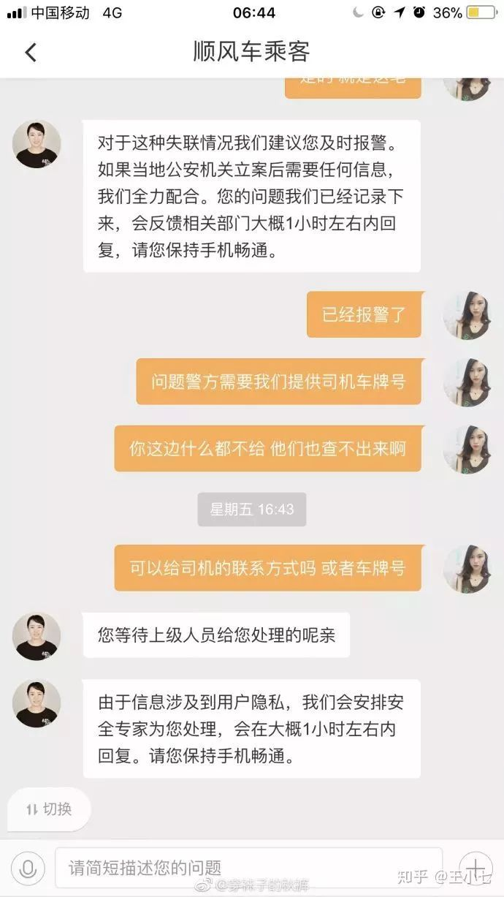
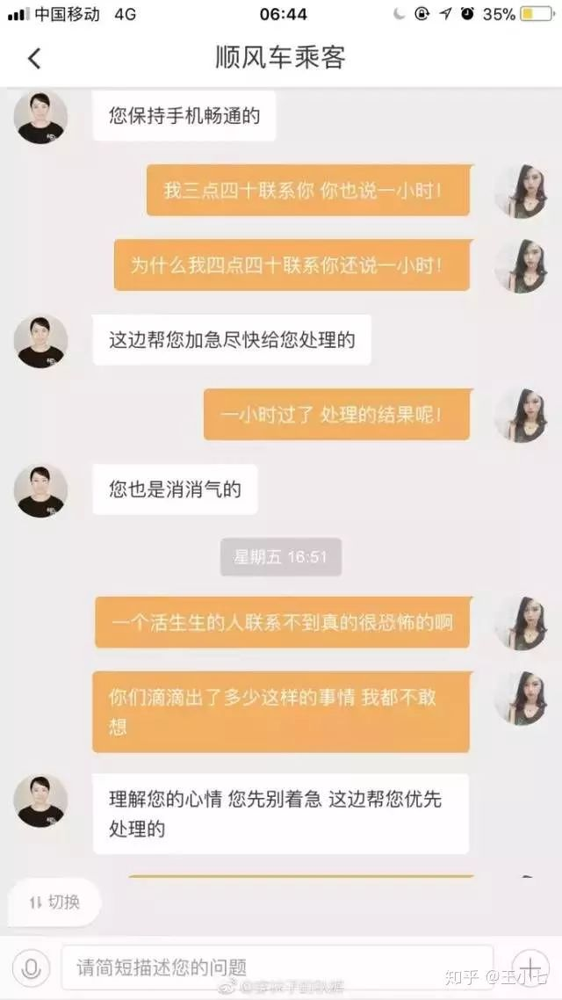
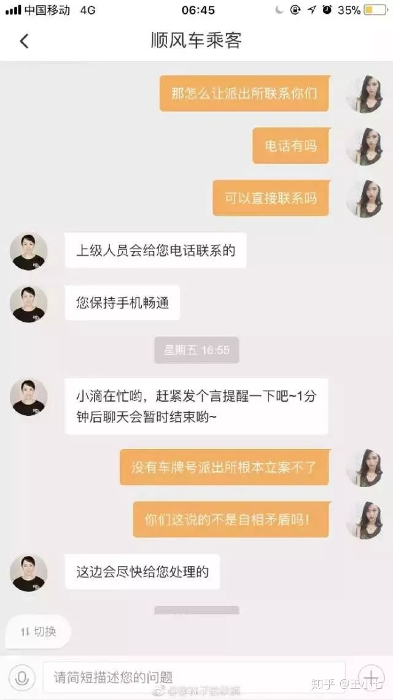
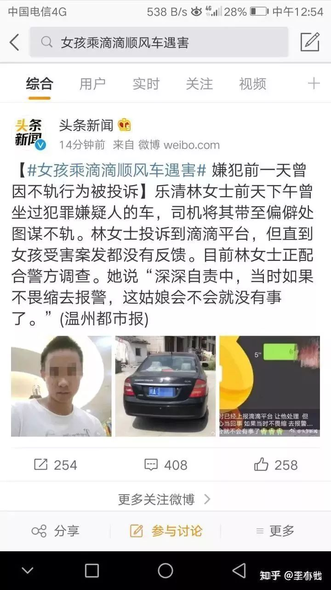

# 滴滴：你随便自救，活下来算我输 

<section mpa-from-tpl="t">
 <section mpa-from-tpl="t" style="white-space: normal;">
  <section mpa-from-tpl="t" style="background-color: rgb(255, 255, 255);">
   <section powered-by="xiumi.us" mpa-from-tpl="t">
    <section mpa-from-tpl="t" style="margin-top: 0.5em;margin-bottom: 0.5em;text-align: center;">
     <section mpa-from-tpl="t" style="display: inline-block;">
      <section mpa-from-tpl="t" style="width: 9px;height: 9px;float: left;border-top: 2px solid rgb(0, 0, 0);border-left: 2px solid rgb(0, 0, 0);">
        
      </section>
      <section mpa-from-tpl="t" style="width: 9px;height: 9px;float: right;border-top: 2px solid rgb(0, 0, 0);border-right: 2px solid rgb(0, 0, 0);">
        
      </section>
      <section mpa-from-tpl="t" style="clear: both;">
        
      </section>
      <section mpa-from-tpl="t" style="margin-top: -5px;margin-bottom: -5px;padding-right: 4px;padding-left: 4px;">
       <section mpa-from-tpl="t" style="padding-right: 20px;padding-left: 20px;border-width: 2px;border-style: solid;border-color: rgb(0, 0, 0);background-color: rgb(0, 0, 0);font-size: 18px;letter-spacing: 0px;color: rgb(255, 255, 255);">
        
<strong mpa-from-tpl="t" mpa-is-content="t">一、就算已经大力整改，</strong>

        
<strong mpa-from-tpl="t" mpa-is-content="t">我们依旧能让你死在车上</strong>

       </section>
      </section>
      <section mpa-from-tpl="t" style="width: 9px;height: 9px;float: left;border-bottom: 2px solid rgb(0, 0, 0);border-left: 2px solid rgb(0, 0, 0);">
        
      </section>
      <section mpa-from-tpl="t" style="width: 9px;height: 9px;float: right;border-bottom: 2px solid rgb(0, 0, 0);border-right: 2px solid rgb(0, 0, 0);">
        
      </section>
     </section>
    </section>
   </section>
  </section>
 </section>
</section>

 

就在8.24日，又一个女孩死于滴滴顺风车——被奸杀、抛尸、满身是血。

<figure data-size="normal" style="margin: 1.4em 1em;color: rgb(26, 26, 26);font-family: -apple-system, BlinkMacSystemFont, 'Helvetica Neue', 'PingFang SC', 'Microsoft YaHei', 'Source Han Sans SC', 'Noto Sans CJK SC', 'WenQuanYi Micro Hei', sans-serif;font-size: 15px;text-align: start;white-space: normal;background-color: rgb(255, 255, 255);">
 
</figure>

而这场死亡的起因，只是因为女孩在一个明媚的午后，选择打了一辆顺风车。

本以为会是一个一如往常的行程，却带着她走向了生命的终结。

就在前天，这个满身阳光，充满青春活力的女孩还在享受自己的大好年华。

昨天这个花季少女的尸体就被搜救队发现：双手布满血污，双腿被紧紧绑住，面目扭曲，已经不成人形。

而这起同样发生在滴滴顺风车上的奸杀案，距离之前震惊全国的空姐奸杀案还不到三个月。

记得在空姐奸杀案被全国人民关注时，滴滴迅速发出了铺天盖地的道歉声明。在滴滴发誓大力整改之后，终于在今天，又一个女孩死于奸杀。

而滴滴所谓痛改前非的整改成果，在这次奸杀案中被淋漓尽致的彰显：

报道称，此次被奸杀的女孩于昨天下午一点半搭乘顺风车，从乐清飞虹南路前往永嘉上塘，常规路况应在两点四十左右到达目的地。

两点十分的时候，她发现司机开的山路没有一辆车，心里觉得不对劲，便给好友发信息“司机开的山路没有一辆车，有点怕”。

两点十五分左右，女孩又给另一好友发出微信“救命、抢救”。

好友发现状况不对，立即拨打电话，但发现女孩的手机已经关机。

好友开始慌神了，各种女孩被杀害的报道开始在脑海里闪过，她焦急地去找滴滴，本以为滴滴会大力配合自己处理这场人命关天的事件，迅速利用平台优势定位到指定司机，以挽救好友的生命。

结果却迎来了这样一个冷漠的回应：建议您先报警立案呢，我们已经向上级反馈了，大概1个小时左右回复。

？？？

一个小时？一个小时都够一个发出救命信号的女孩死一百次了吧？

就算你不想管，你也得先给我查出司机的车牌号吧？你不给车牌号你又让警方怎么去查？

而且因为滴滴本身有司机实名机制，再加上网约车全平台的定位系统，如果滴滴能积极介入，很有可能迅速找到女孩所乘坐的顺风车。

结果客服就那么把女孩的好友晾在了那里，好像多表达一点关切就能把自己累死。

好，我奈何不了你，我等。

过了一小时后，女孩的好友再次催促滴滴客服。焦急地询问当前状况。

结果再次迎来了滴滴冷漠的回应：请您稍等1小时。

<figure data-size="normal" style="margin: 1.4em 1em;color: rgb(26, 26, 26);font-family: -apple-system, BlinkMacSystemFont, 'Helvetica Neue', 'PingFang SC', 'Microsoft YaHei', 'Source Han Sans SC', 'Noto Sans CJK SC', 'WenQuanYi Micro Hei', sans-serif;font-size: 15px;text-align: start;white-space: normal;background-color: rgb(255, 255, 255);">
 
</figure>
<figure data-size="normal" style="margin: 2.24em 1em 1.4em;color: rgb(26, 26, 26);font-family: -apple-system, BlinkMacSystemFont, 'Helvetica Neue', 'PingFang SC', 'Microsoft YaHei', 'Source Han Sans SC', 'Noto Sans CJK SC', 'WenQuanYi Micro Hei', sans-serif;font-size: 15px;text-align: start;white-space: normal;background-color: rgb(255, 255, 255);">
 
</figure>

 

<figure data-size="normal" style="margin: 1.4em 1em;color: rgb(26, 26, 26);font-family: -apple-system, BlinkMacSystemFont, 'Helvetica Neue', 'PingFang SC', 'Microsoft YaHei', 'Source Han Sans SC', 'Noto Sans CJK SC', 'WenQuanYi Micro Hei', sans-serif;font-size: 15px;text-align: start;white-space: normal;background-color: rgb(255, 255, 255);">
 
</figure>

面对一场性命攸关的案件，对方竟然只有踢皮球般的一口一个上级，一口一个“尽快回给你处理”。

最后滴滴生生把这场牵涉到一条生命的大案件从3点拖到5点，并依然没有任何作为。

四五个小时之后，滴滴终于发现了自己这边还有一桩人命关天的案子，联系到女孩的家人说：我们联系过司机了，他说女孩没上车。

于是在今日清晨，警方发现了女孩，并证实女孩被顺风车司机奸杀。

而且在奸杀犯被抓后，又爆出一则消息：这个司机已经不是第一次作案了。

<figure data-size="normal" style="margin: 1.4em 1em;color: rgb(26, 26, 26);font-family: -apple-system, BlinkMacSystemFont, 'Helvetica Neue', 'PingFang SC', 'Microsoft YaHei', 'Source Han Sans SC', 'Noto Sans CJK SC', 'WenQuanYi Micro Hei', sans-serif;font-size: 15px;text-align: start;white-space: normal;background-color: rgb(255, 255, 255);">
 
</figure>

诸如“投诉之后没有得到反馈”的字眼明明白白地说着：在这之前很可能已经有多名女子被性骚扰，甚至发生过一些我们难以想象的事情。

而这一切都归功于滴滴所谓的“痛改前非”、“重大改革”。

如果滴滴能“真正”加大司机审查力度，这样的奸杀司机会不会就根本不会出现？

如果滴滴能在顾客投诉之后及时调查，这起奸杀案会不会根本就不会发生？

如果滴滴可以及时对求救信号做出反应，女孩的性命是不是就能挽救回来？

可惜没如果。

我们甚至可以说，滴滴那漏洞百出的司机审查制度、冷血无情的客服、滞后的反馈系统才是真正的杀人凶手。

滴滴通过自己的大力整改再次向我们证明：就算我们已经“大力整改”，我们依旧能让你死在车上。

 

<section mpa-from-tpl="t">
 <section mpa-from-tpl="t" style="white-space: normal;">
  <section mpa-from-tpl="t" style="background-color: rgb(255, 255, 255);">
   <section powered-by="xiumi.us" mpa-from-tpl="t">
    <section mpa-from-tpl="t" style="margin-top: 0.5em;margin-bottom: 0.5em;text-align: center;">
     <section mpa-from-tpl="t" style="display: inline-block;">
      <section mpa-from-tpl="t" style="width: 9px;height: 9px;float: left;border-top: 2px solid rgb(0, 0, 0);border-left: 2px solid rgb(0, 0, 0);">
        
      </section>
      <section mpa-from-tpl="t" style="width: 9px;height: 9px;float: right;border-top: 2px solid rgb(0, 0, 0);border-right: 2px solid rgb(0, 0, 0);">
        
      </section>
      <section mpa-from-tpl="t" style="clear: both;">
        
      </section>
      <section mpa-from-tpl="t" style="margin-top: -5px;margin-bottom: -5px;padding-right: 4px;padding-left: 4px;">
       <section mpa-from-tpl="t" style="padding-right: 20px;padding-left: 20px;border-width: 2px;border-style: solid;border-color: rgb(0, 0, 0);background-color: rgb(0, 0, 0);font-size: 18px;letter-spacing: 0px;color: rgb(255, 255, 255);">
        
<strong mpa-from-tpl="t" mpa-is-content="t">二、你随便自救，</strong>

        
<strong mpa-from-tpl="t" mpa-is-content="t">活下来算我输</strong>

       </section>
      </section>
      <section mpa-from-tpl="t" style="width: 9px;height: 9px;float: left;border-bottom: 2px solid rgb(0, 0, 0);border-left: 2px solid rgb(0, 0, 0);">
        
      </section>
      <section mpa-from-tpl="t" style="width: 9px;height: 9px;float: right;border-bottom: 2px solid rgb(0, 0, 0);border-right: 2px solid rgb(0, 0, 0);">
        
      </section>
     </section>
    </section>
   </section>
  </section>
 </section>
</section>

 

我知道这个事件爆出之后，一定会迅速出现各种教女性防身、避免灾祸的文章。 

但已经发生的事实可以清清楚楚地告诉你：任你再精通防身技巧，遇到类似的情况你也必死无疑。

这次的女孩奸杀案和三个月前的空姐奸杀案几乎如出一辙：

当时空姐也是在下班后如常赶去火车站，选择打了一辆顺风车。

当感受到司机在进行语言性骚扰时，空姐立刻警觉，迅速发微信通知了好友。

好友也迅速支招，让她假装给她打电话，并把她当做自己的老公。

<figure data-size="normal" style="margin: 1.4em 1em;color: rgb(26, 26, 26);font-family: -apple-system, BlinkMacSystemFont, 'Helvetica Neue', 'PingFang SC', 'Microsoft YaHei', 'Source Han Sans SC', 'Noto Sans CJK SC', 'WenQuanYi Micro Hei', sans-serif;font-size: 15px;text-align: start;white-space: normal;background-color: rgb(255, 255, 255);">
 
</figure>

于是空姐便迅速拨打了室友的电话，以和老公对话的口吻聊自己现在的状况，结果刚和室友打完电话，就被司机拿刀挟持。

就连她们的结局都是类似的，当警方发现尸体的时候，空姐下半身裸露，并布满二十多处刀痕，鲜血淋漓。

看到了么？

这两个遇害的女孩都不是那些所谓没有安全意识的人，她们都富有警觉意识并且掌握了自救技巧：

空姐在发现被语言骚扰后便迅速向室友求助、甚至伪装成和老公打电话来延长警方营救时间。

女孩在发现路况不对后也迅速向不止一个好友求救，甚至直接说“救命”。

她们都警觉意识到位、及时向别人求助、甚至假装打电话延长救援缓冲时间。

你说还要她们怎么做才能避免这场“注定会发生的奸杀案”？

一切的死因都不是她们疏于安全意识，而是滴滴的重大疏漏。

而滴滴正在用一次次的口头道歉和平台公关来弥补这些用生命检验出的疏漏。

滴滴用血淋淋的事实告诉我们：无论你多精通自救技巧，我们都能让你死在车上。

 

<section mpa-from-tpl="t">
 <section mpa-from-tpl="t" style="white-space: normal;">
  <section mpa-from-tpl="t" style="background-color: rgb(255, 255, 255);">
   <section powered-by="xiumi.us" mpa-from-tpl="t">
    <section mpa-from-tpl="t" style="margin-top: 0.5em;margin-bottom: 0.5em;text-align: center;">
     <section mpa-from-tpl="t" style="display: inline-block;">
      <section mpa-from-tpl="t" style="width: 9px;height: 9px;float: left;border-top: 2px solid rgb(0, 0, 0);border-left: 2px solid rgb(0, 0, 0);">
        
      </section>
      <section mpa-from-tpl="t" style="width: 9px;height: 9px;float: right;border-top: 2px solid rgb(0, 0, 0);border-right: 2px solid rgb(0, 0, 0);">
        
      </section>
      <section mpa-from-tpl="t" style="clear: both;">
        
      </section>
      <section mpa-from-tpl="t" style="margin-top: -5px;margin-bottom: -5px;padding-right: 4px;padding-left: 4px;">
       <section mpa-from-tpl="t" style="padding-right: 20px;padding-left: 20px;border-width: 2px;border-style: solid;border-color: rgb(0, 0, 0);background-color: rgb(0, 0, 0);font-size: 18px;letter-spacing: 0px;color: rgb(255, 255, 255);">
        
<strong mpa-from-tpl="t" mpa-is-content="t">三、不要让今天被奸杀的女孩，</strong>

        
<strong mpa-from-tpl="t" mpa-is-content="t">变成明天的我们</strong>

       </section>
      </section>
      <section mpa-from-tpl="t" style="width: 9px;height: 9px;float: left;border-bottom: 2px solid rgb(0, 0, 0);border-left: 2px solid rgb(0, 0, 0);">
        
      </section>
      <section mpa-from-tpl="t" style="width: 9px;height: 9px;float: right;border-bottom: 2px solid rgb(0, 0, 0);border-right: 2px solid rgb(0, 0, 0);">
        
      </section>
     </section>
    </section>
   </section>
  </section>
 </section>
</section>

 

可以预见的是，这件奸杀案被爆出后，一定会产生对滴滴铺天盖地的声讨。 

诸如“滴滴禽兽不如”、“祝滴滴早日倒闭”、“滴滴不倒闭就是国人的耻辱”之类的愤怒必定会席卷各大网络平台。

但在声讨滴滴的同时，我们必须认识到另外一个事实：滴滴所处的行业是网约车，网约车行业不止滴滴一家，诸如美团、曹操、神州等等，都有自己的打车APP，这些APP一起，构成了网约车行业。

这也就意味着：就算巨头滴滴倒闭，网约车行业也绝对不会就此绝迹，滴滴之后一定会有另一个滴滴，无数个滴滴。

并且因为网约车的便利性，随着经济的发展网约车需求绝不会就此衰减，反而势必会越来越大。

而与滴滴类似的网约车企业与我们的出行安全密切相关，因为谁也不能保证自己出行在外就能完全不乘坐网约车。而诸如收缩网约车、消灭网约车的呐喊根本不现实。

所以我想说的是，我们对滴滴的声讨势在必行，但我们对此事的关注不应仅停留在热点本身，仅仅关心滴滴最后是否得到了应有的惩戒、是否赔偿了死者家属，而应该把更多的注意力放在网约车平台的安全机制是否得到了进一步改善上。

这个安全机制应该由政府、网约车企业、警方、人民监督机制共同建构和负责。

这个机制的完善程度事关我们的生命安全，因为谁也不知道这样一起奸杀案会不会明天就发生在自己身上。

政府是否在积极监管网约车平台、所有网约车公司是否建立了严格的司机审查机制、网约车公司的服务系统是否完善、服务人员培育机制是否合理、网约车公司信息系统是否能与警方完整对接，这些能确保我们出行安全的各个关键点，应当在又一个生命逝去、大家正在关注此事的时刻加紧建构。

不然等到热点消退，一切又将回归平静，对网约车相关公司和政府的舆论压力将再次如上次“空姐奸杀案”一般断崖式衰减。

网约车的安全机制构建又将变成一场生命逝去后的情绪狂欢，女孩的死亡将没有任何意义。

所以拜托，不要让今天被奸杀的女孩，变成明天的我们。

更不要让一个滴滴的倒下，换来另外一个罔顾生命的“滴滴”的崛起

请不要这样的残酷最终成为事实：滴滴倒下后，其他网约车公司依旧能让你死在车上。

 

PS：大号被封杀了，我只能力所能及地把我存的一些稿件放在这里了，谢谢你的关注与陪伴。新朋友就关注这个账号吧。我们一起加油。

 **更新时间：2020-07-09 13:57:19**