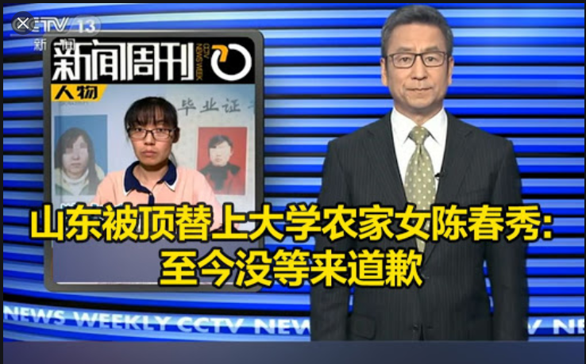
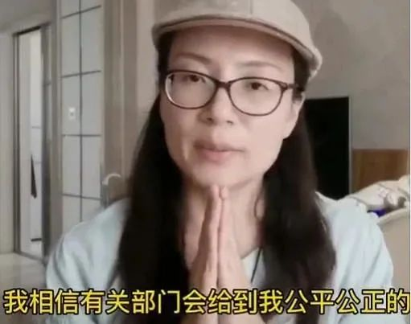
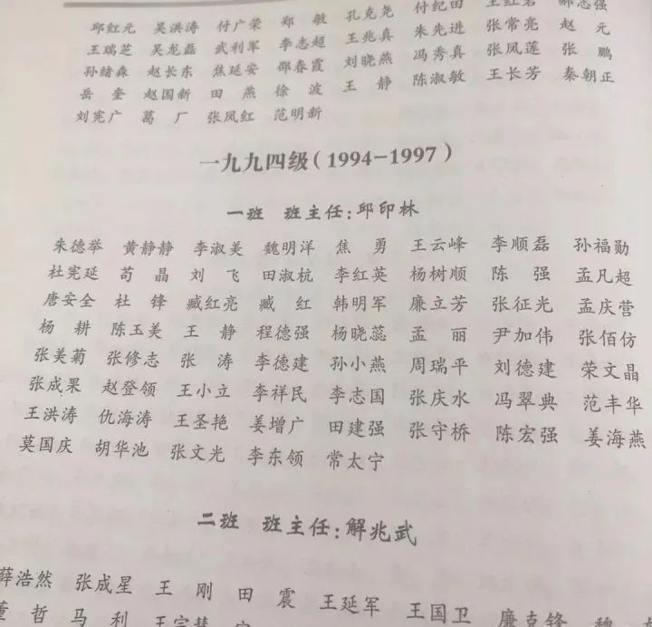

# 谢谢苟晶，谢谢陈春秀。 
月末感触良多，写点心里话。 

距离陈春秀事件曝光已经过去快一个月了，在六月的末尾我遥望这一个月，恍若隔世。可能大家几乎已经快忘记、甚至厌倦了那个不停追问的姑娘了吧。 

<section style="margin-bottom: 20px;line-height: 1.75em;margin-top: 20px;">
 但至今她仍然没能等到答案。 
</section>

或许是看到了陈春秀的力竭，另外一个农家女接过了陈春秀手中的火炬。

6月22日，苟晶在陈春秀事件相关微博下发表评论，称自己与陈春秀一样，是高考顶替事件的受害者。

<section style="margin-bottom: 20px;line-height: 1.75em;margin-top: 20px;">
 她中考免考，被保送到市里最好的高中之一。在分班考试中，考进了尖子班中的尖子班，成绩一直领跑全班，结果却在高考里跌到倒数，再度参加高考，成绩依旧领跑全班，结果再次跌倒在高考，最终心灰意冷选择外出打工，父亲则在自我责备中过世。
</section>

多年以后，在知道自己曾被高考顶替后，苟晶气得浑身发抖，抱着孩子的她选择了沉默，她觉得她斗不过自己的老师，又觉得即便讨要到了答案，已经拥有家庭和孩子的自己，又怎么可能回得去曾经渴望的人生呢？

曾经与苟晶同班的同学都已出人头地，里面有八个博士，四、五个大学教授。还有一姓孙的同学，是山东某市的局级干部。

曾经领跑的苟晶却因为和<strong>“班主任女儿长相相似”</strong>，就被剥夺了未来。

多年后的今天，曾经绝望的苟晶，终于不再沉默，想要站出来讨还公道，她说她只想为病逝的父亲讨要一个回答。

<strong>但她何曾想过，事件曝光后，才是她生死劫的开始。</strong>

据天下网商的报道，苟晶在发帖之后，压向苟晶的第一层压力就是她老家的亲戚朋友：

陆续有山东的电话打到家中，告诉苟晶当地很重视，成立了专案组进行调查。除此之外，电话中还有一些委婉的表示：“中心思想不外乎希望我删帖，认为我把在全国网友面前破坏了济宁的正面形象。也去我老家，联系我的亲戚朋友们劝我把帖子删掉。”

老家的亲戚也发了脾气：<strong>为什么要把事情闹这么大，我们还要不要在这里混了。</strong>

后来她也不敢接电话了，几百个陌生号码争前恐后涌进她的手机。有人在微信里约见面，她回一句：“如果我能活着见到你的话。”

这句话并不夸张。监控视频里，一辆山东牌照的白色小汽车堵在了厂区门口，几名大汉下了车，从中午12点守到晚上7点多。

<strong>与此同时，邱老师在厂区里晃悠，时刻等着苟晶。</strong>

去年，苟晶的女儿也参加了高考。她穿着旗袍去到现场助威，还将家人合影发了一条朋友圈。但现在，她把这条朋友圈隐藏了起来。她害怕了，她怕有人循迹找到孩子，伤害孩子。

或许苟晶没有想到，自己只是想求个公道而已，没想到公道还没来，自己却已经身处困境与危机之中。

前段时间因为陈春秀事件，山东开始彻查高考顶替案件，全国都开始重视起来。直到这个时候我们才了解到，在过去两年中，就已经查处了242起冒名顶替上大学的事件，可是那被顶替的242名学生，仿佛被调了静音模式，一声不吭，这是难以置信的。

或许他们也是看到了如今苟晶们的下场，选择妥协吧，或许只是选择沉默，把斗争的希望寄托给愿意出头的苟晶们。

苟晶和陈春秀在为自己争一个公道，又何尝不是在为那些沉默者发声，又何尝不是在为我们以后的制度公平铺路。她们背负的不仅是她们的命运。她们需要公道，我们更需要一个答案。

<strong>她们艰难地为我们举起了火炬，而我们要做的，只是努力让这把火炬不再熄灭。</strong>

如果没有她们的勇敢，她们站在阳光下承受那些明枪暗箭，又怎么会有山东省全省彻查高考顶替，又怎么会有国家对高考顶替事件的再度重视，她们在替贫寒子弟发声，用一次次声泪俱下，声嘶力竭地控诉那些利用权钱篡改他人人生者。

即便陈春秀与苟晶依旧没等到满意的答案，但在这一个月里，我们等来了仝卓高考舞弊的处理结果，等来了山东省全省彻查高考顶替。

仝卓被宣布高考成绩无效，毕业证撤销，继父撤职，多人被处分。

<figure data-size="normal">
 

</figure>

家境优渥的仝卓一定无法理解贫寒子弟的那种深入骨髓的苦楚，他投胎在一个好的家庭，父母当权，人生顺遂，曾经舞弊的手段也可以成为骄傲的资本，在镜头前挤眉弄眼，好不自得。

他不会理解陈春秀的声泪俱下，不会理解陈春秀父亲“都是我无能”的辛酸。

不会理解苟晶的二妹需要辍学去打工去做一天挣一块钱的工作，才能让苟晶继续读书，不会理解苟晶病重的父亲，会因为知道苟晶被顶替就愤怒的不能自已。

更不会理解贫寒子弟将高考视作自己一生翻身希望的那种沉重。

如今，几日前在屏幕前哭泣的农家女陈春秀，似乎已经逐渐淡出了我们的视野，苟晶的质疑也依旧没有什么明确的答案，但她们依旧没有放弃，我们更不应该放弃，公平从来都是高考的底线，没有公平的高考，没有任何意义。

苟晶是勇敢的，陈春秀也是勇敢的，她们的勇敢不只是在于她敢于讨还公道，还在于她们在“被冒名顶替”后的人生中，没有一蹶不振，没有认命，反而奋发图强。

陈春秀在被顶替15年后，本已成家，家境好转，但又重拾梦想参加了成人高考，考入曲阜师范大学。

苟晶两次被顶替之后，她去杭州骑着自行车销售化妆品、软件，每天骑几十公里，晚上累得全身骨头疼，也会微笑着第二天再爬起来工作，数次应聘过阿里巴巴，后来又开淘宝店，多年打拼，终于成为了一家童装公司的电商合伙人，也在杭州买了房子，刻意买在一所大学对面，“想离文化近些”。

她们那种面对绝境的勇气与不屈让人潸然泪下，这需要多大的勇敢、多顽强的意志才能不被生活的残酷压垮，才能微笑着面对明天依旧会到来的暗无天日。

看到如今的她们，我是心疼的，更是钦佩的。她们是如此的倔强，被生活扇了耳光也能微笑前行，她们莫大的勇敢甚至给了我努力生活的力量。

<strong>谢谢苟晶，谢谢陈春秀。</strong>

 

<strong>往期文章：</strong>

<a target="_blank" href="http://mp.weixin.qq.com/s@·@__biz=MzUxOTk0MTA4NA==&amp;mid=2247485334&amp;idx=1&amp;sn=e81a4d3f41119b447b9fbc6f78db9a80&amp;chksm=f9f0b925ce873033c74d2f3aa765900abec09eebf1d48daaea1acaa38c14dc1bb99942b59e60&amp;scene=21#wechat_redirect" data-itemshowtype="0" tab="innerlink" style="font-size: 15px;text-decoration: underline;" data-linktype="2">拧巴的杨超越，三度成为风暴眼，击碎了中国社会的三层幻象</a> 

<a target="_blank" href="http://mp.weixin.qq.com/s@·@__biz=MzUxOTk0MTA4NA==&amp;mid=2247485147&amp;idx=1&amp;sn=da0a3145d95677ad4d949d329bb715bf&amp;chksm=f9f0b868ce87317e19677994ff655957d73e994e644c6f6bc68e75dd0da5b38be7d1737551d8&amp;scene=21#wechat_redirect" data-itemshowtype="0" tab="innerlink" data-linktype="2" style="text-decoration: underline;">可是，那些为缪可馨哭泣的人，不也是帮凶吗？</a> 

<a target="_blank" href="http://mp.weixin.qq.com/s@·@__biz=MzUxOTk0MTA4NA==&amp;mid=2247484839&amp;idx=1&amp;sn=17f5b77c6ca0e49227882e4be93be8f4&amp;chksm=f9f0bb14ce873202b05153cc94ba1cbe0c4921009e24b53026699396f86ec78d53080cdd9683&amp;scene=21#wechat_redirect" data-itemshowtype="0" tab="innerlink" data-linktype="2" style="text-decoration: underline;font-size: 15px;">我害怕李文亮之妻被民意绑架，甚至毁掉</a> 

<a target="_blank" href="http://mp.weixin.qq.com/s@·@__biz=MzUxOTk0MTA4NA==&amp;mid=2247484540&amp;idx=1&amp;sn=586589317ab78af3e7c5f25b8385cd5a&amp;chksm=f9f0bacfce8733d95535753c8e52ffa1af95a009a824ed92db26177aeb82404ab3e1d9e6aedf&amp;scene=21#wechat_redirect" textvalue="地摊经济：出路还是天坑？" data-itemshowtype="0" tab="innerlink" data-linktype="2" style="text-decoration: underline;font-family: &quot;Helvetica Neue&quot;, Helvetica, &quot;Hiragino Sans GB&quot;, &quot;Microsoft YaHei&quot;, Arial, sans-serif;font-size: 15px;">地摊经济：出路还是天坑？</a>

<a target="_blank" href="http://mp.weixin.qq.com/s@·@__biz=MzUxOTk0MTA4NA==&amp;mid=2247484285&amp;idx=1&amp;sn=d8d1d225970495addae8c972f5fc1787&amp;chksm=f9f0bdcece8734d8845306ea300ab4c4ada69550eab01d19c2ea0712c6b83e16e8264a3f617c&amp;scene=21#wechat_redirect" textvalue="黑人暴乱：一场涉及世界的定义权之战" data-itemshowtype="0" tab="innerlink" data-linktype="2" style="text-decoration: underline;font-family: &quot;Helvetica Neue&quot;, Helvetica, &quot;Hiragino Sans GB&quot;, &quot;Microsoft YaHei&quot;, Arial, sans-serif;font-size: 15px;">黑人暴乱：一场涉及世界的定义权之战</a>

<a target="_blank" href="http://mp.weixin.qq.com/s@·@__biz=MzUxOTk0MTA4NA==&amp;mid=2247484272&amp;idx=1&amp;sn=34e1b7424cf30e27d4a0d31bd6e5f350&amp;chksm=f9f0bdc3ce8734d5dce092ab62b00b69dfb71856da95a7013ebbc024ebcc8e0e1d63b694206d&amp;scene=21#wechat_redirect" textvalue="世界灯火被永久封禁了，可我还不想认输" data-itemshowtype="0" tab="innerlink" data-linktype="2" style="text-decoration: underline;font-family: &quot;Helvetica Neue&quot;, Helvetica, &quot;Hiragino Sans GB&quot;, &quot;Microsoft YaHei&quot;, Arial, sans-serif;font-size: 15px;">世界灯火被永久封禁了，可我还不想认输</a>

<a target="_blank" href="http://mp.weixin.qq.com/s@·@__biz=MzUxOTk0MTA4NA==&amp;mid=2247484267&amp;idx=1&amp;sn=ac0b0382b3f76387f77c69868c4f055d&amp;chksm=f9f0bdd8ce8734ce6a3682ac2077b33d729e95225fd4e66243d91939c61b76b7abcc0060faed&amp;scene=21#wechat_redirect" textvalue="毁掉底层阶级，你只需要这一句话" data-itemshowtype="0" tab="innerlink" data-linktype="2">毁掉底层阶级，你只需要这一句话</a>

 

大号阵亡了，想看大号里之前关于“香港问题”“高考真相”“各种案例分析”等深度文章，请点击后台菜单栏<strong>“往期精选”</strong>。

 

<strong style="background-color: rgb(255, 255, 255);">PS：1、</strong>不出意外会继续写<strong>高考恢复43年来的曲折演变史</strong>，比较长，耗时有点久，敬请期待。

<strong>2、</strong>想要阅读更多<strong style="letter-spacing: 0.544px;color: rgb(0, 0, 0);">深度文章</strong>的朋友记得关注我啊，<strong style="letter-spacing: 0.544px;color: rgb(0, 0, 0);">希望能与你一起同行，记录与见证时代。</strong>

<strong>无论点赞还是转发分享，皆是支持。</strong>

 **更新时间：2020-07-09 13:49:15**