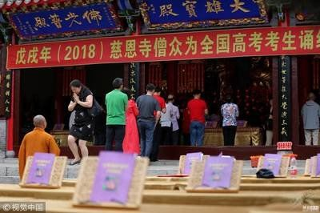
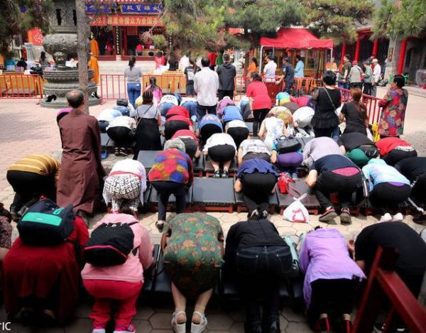
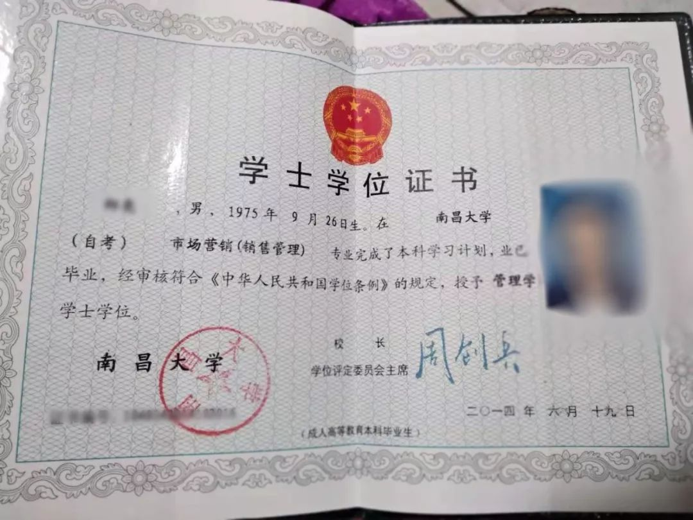
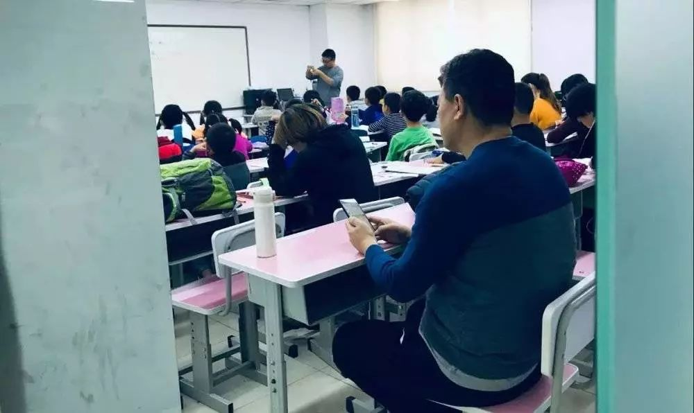
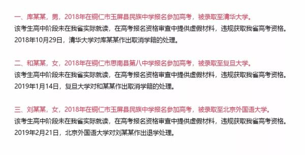
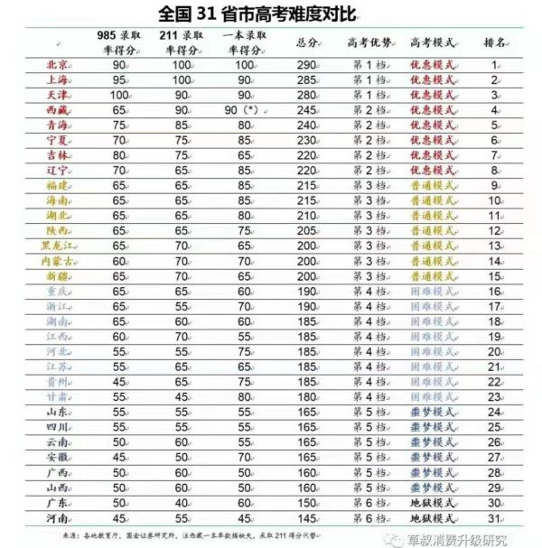
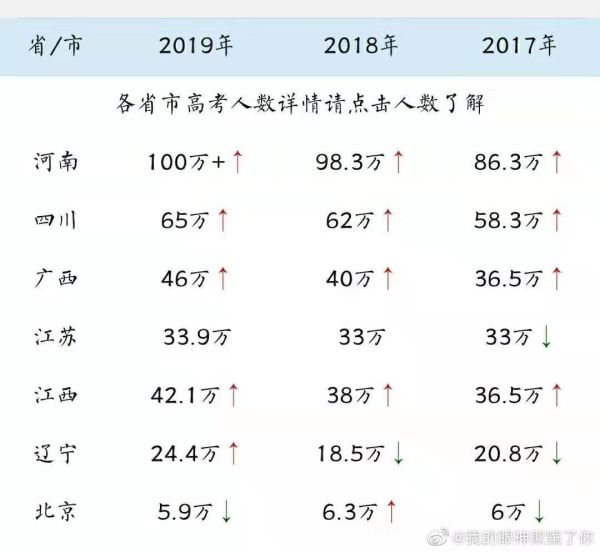
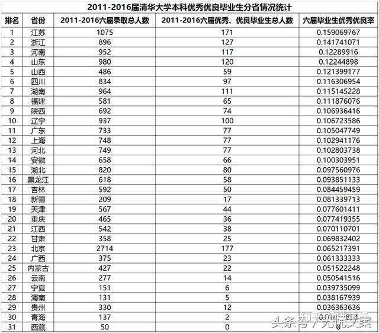

# 高考围城困局：阶级翻身之战里的黑暗博弈 <section class="" mpa-from-tpl="t" style="margin-left: 1em;margin-right: 1em;" data-mpa-powered-by="yiban.io">
 
 

 <section powered-by="xiumi.us" style="margin-top: 10px;margin-bottom: 10px;max-width: 100%;box-sizing: border-box;text-align: center;word-wrap: break-word !important;" class="" mpa-from-tpl="t">
  <section style="max-width: 100%;box-sizing: border-box;display: inline-block;word-wrap: break-word !important;" mpa-from-tpl="t">
   <section style="margin-bottom: -0.5em;margin-left: -0.2em;max-width: 100%;box-sizing: border-box;width: 0.8em;height: 0.8em;transform: rotate(0deg);word-wrap: break-word !important;" class="" mpa-from-tpl="t">
    <section style="max-width: 100%;box-sizing: border-box;width: 0.8em;height: 1px;transform-origin: left top 0px;transform: rotate(45deg);background-color: rgb(14, 14, 13);word-wrap: break-word !important;" class="" mpa-from-tpl="t"></section>
   </section>
   <section style="max-width: 100%;box-sizing: border-box;border-width: 1px;border-style: solid;border-color: rgb(14, 14, 13);width: 2em;height: 2em;line-height: 2em;word-wrap: break-word !important;" mpa-from-tpl="t">
    
1

   </section>
   <section style="margin-top: -0.55em;margin-right: -0.3em;margin-left: auto;max-width: 100%;box-sizing: border-box;width: 0.8em;height: 0.8em;transform: rotate(180deg);word-wrap: break-word !important;" mpa-from-tpl="t">
    <section style="max-width: 100%;box-sizing: border-box;width: 0.8em;height: 1px;transform-origin: left bottom 0px;transform: rotate(45deg);background-color: rgb(14, 14, 13);word-wrap: break-word !important;" mpa-from-tpl="t"></section>
   </section>
  </section>
 </section>
 <section class="" powered-by="xiumi.us" style="padding-right: 25px;padding-left: 25px;max-width: 100%;box-sizing: border-box;text-align: center;line-height: 2;letter-spacing: 1px;word-wrap: break-word !important;" mpa-from-tpl="t">
  
<strong>高考今夕</strong>

 </section>
</section>

北大三次因退档河南考生，致使舆论哗然，在群众连番谴责与重压下，8月11日北大选择补录该考生。

而距上一次群众因高考相关事宜群情激奋，只过去了<strong>短短三个月。</strong>

今年5月份，深圳一次高考模拟引发了一场涉及整个广东省的大排查，在这次模拟中，一所丝毫不知名的富源中学，突然碾压深圳“四大名校”，全市理科前10名就独占6名。

要知道，清华在整个广东一年才招68个理科生和3个文科生。（随年头略有变化）

而后经由深圳家长检举，深圳市调查发现，进入此次“二模”前100名的学生中，竟然有10余名学生均从河北衡水第一中学转入。而这些学生都是富源中学为提高本校知名度从外地买入，皆为非法高考移民。

对此广东省教育厅雷厉风行，所有考前被发现的高考移民必须回原籍地考试，考后发现则直接取消成绩。政策一出便引发大批群众支持，很多深圳家长直接表示：“拒绝把衡水模式带到深圳”。

巧合的是，这两起事件恰好分属<strong>“高考前与高考后”</strong>，群众对考生态度也恰恰分立为<strong>“指责与拥护”</strong>。

为何群众对考生态度如此截然不同？

因为两起事件又恰恰分属<strong>“规则内与规则外”</strong>，北大所退档的河南考生完全遵守了高考游戏规则，践踏规则者为北大单方，而深圳事件则是考生践踏规则，违规高考移民，抢夺广东资源，广东省则成为考生践踏规则的受害者。

<strong>而所有高考现象，也恰恰可以根据“规则内和规则外”被分为两类。</strong>

<section class="" mpa-from-tpl="t" style="margin-left: 1em;margin-right: 1em;">
 
 

 <section powered-by="xiumi.us" style="margin-top: 10px;margin-bottom: 10px;max-width: 100%;box-sizing: border-box;text-align: center;word-wrap: break-word !important;" class="" mpa-from-tpl="t">
  <section style="max-width: 100%;box-sizing: border-box;display: inline-block;word-wrap: break-word !important;" mpa-from-tpl="t">
   <section style="margin-bottom: -0.5em;margin-left: -0.2em;max-width: 100%;box-sizing: border-box;width: 0.8em;height: 0.8em;transform: rotate(0deg);word-wrap: break-word !important;" class="" mpa-from-tpl="t">
    <section style="max-width: 100%;box-sizing: border-box;width: 0.8em;height: 1px;transform-origin: left top 0px;transform: rotate(45deg);background-color: rgb(14, 14, 13);word-wrap: break-word !important;" class="" mpa-from-tpl="t"></section>
   </section>
   <section style="max-width: 100%;box-sizing: border-box;border-width: 1px;border-style: solid;border-color: rgb(14, 14, 13);width: 2em;height: 2em;line-height: 2em;word-wrap: break-word !important;" mpa-from-tpl="t">
    
2

   </section>
   <section style="margin-top: -0.55em;margin-right: -0.3em;margin-left: auto;max-width: 100%;box-sizing: border-box;width: 0.8em;height: 0.8em;transform: rotate(180deg);word-wrap: break-word !important;" mpa-from-tpl="t">
    <section style="max-width: 100%;box-sizing: border-box;width: 0.8em;height: 1px;transform-origin: left bottom 0px;transform: rotate(45deg);background-color: rgb(14, 14, 13);word-wrap: break-word !important;" mpa-from-tpl="t"></section>
   </section>
  </section>
 </section>
 <section class="" powered-by="xiumi.us" style="padding-right: 25px;padding-left: 25px;max-width: 100%;box-sizing: border-box;text-align: center;line-height: 2;letter-spacing: 1px;word-wrap: break-word !important;" mpa-from-tpl="t">
  
<strong style="max-width: 100%;box-sizing: border-box;word-wrap: break-word !important;" mpa-from-tpl="t">不得超脱的高考围城</strong>

 </section>
</section>

 

2018年，00后挣脱了高考枷锁，踏入大学，但这一年，有一位<strong>40岁“大龄”新生</strong>却显得格外引人注目。她是西安工程大学2018级新生——汤晓艳。

1996年至1998年，汤晓艳曾3次参加高考，都没能上大学，22年后，父母接连去世，40多岁的汤晓艳终于如愿以偿，拿到通知书的一刻她难以相信，觉得自己终于实现了<strong>母亲的遗愿。</strong>

这场跨时二十余年的高考历程令人唏嘘，更让人看到高考在人们心中沉甸甸的重量，但也不免让人思考：“花二十多年只为了一个高考文凭，40多岁进入大学校园，只为完成母亲的意愿，<strong>这一切真的值得吗？</strong>”

但这个时代的我们，已经来不及思考，<strong>都被裹挟在高考的浪潮中无法脱身。</strong>

钱钟书曾言：“婚姻是一座围城，城外的人想进去，城里的人想出来。” 

<strong>婚姻如此，高考亦是如此</strong>，我化用钱老先生这一说法，把高考规则这一内外之分，称作<strong>当代高考围城</strong>：“<strong>规则外</strong>得势的人胆战心惊，后悔当初跳出规则，<strong>规则内</strong>的人想要跳脱规则，羡慕规则外的人轻松得势，自己却毫无门路，想要早日结束高考之战，却永远不得超升。”

<section class="" mpa-from-tpl="t">
 
 

 <section powered-by="xiumi.us" style="margin-top: 10px;margin-bottom: 10px;max-width: 100%;box-sizing: border-box;text-align: center;word-wrap: break-word !important;" class="" mpa-from-tpl="t">
  <section style="max-width: 100%;box-sizing: border-box;display: inline-block;word-wrap: break-word !important;" mpa-from-tpl="t">
   <section style="margin-bottom: -0.5em;margin-left: -0.2em;max-width: 100%;box-sizing: border-box;width: 0.8em;height: 0.8em;transform: rotate(0deg);word-wrap: break-word !important;" class="" mpa-from-tpl="t">
    <section style="max-width: 100%;box-sizing: border-box;width: 0.8em;height: 1px;transform-origin: left top 0px;transform: rotate(45deg);background-color: rgb(14, 14, 13);word-wrap: break-word !important;" class="" mpa-from-tpl="t"></section>
   </section>
   <section style="max-width: 100%;box-sizing: border-box;border-width: 1px;border-style: solid;border-color: rgb(14, 14, 13);width: 2em;height: 2em;line-height: 2em;word-wrap: break-word !important;" mpa-from-tpl="t">
    
3

   </section>
   <section style="margin-top: -0.55em;margin-right: -0.3em;margin-left: auto;max-width: 100%;box-sizing: border-box;width: 0.8em;height: 0.8em;transform: rotate(180deg);word-wrap: break-word !important;" mpa-from-tpl="t">
    <section style="max-width: 100%;box-sizing: border-box;width: 0.8em;height: 1px;transform-origin: left bottom 0px;transform: rotate(45deg);background-color: rgb(14, 14, 13);word-wrap: break-word !important;" mpa-from-tpl="t"></section>
   </section>
  </section>
 </section>
 <section class="" powered-by="xiumi.us" style="padding-right: 25px;padding-left: 25px;max-width: 100%;box-sizing: border-box;text-align: center;line-height: 2;letter-spacing: 1px;word-wrap: break-word !important;" mpa-from-tpl="t">
  
<strong style="max-width: 100%;box-sizing: border-box;word-wrap: break-word !important;" mpa-from-tpl="t">围城以内</strong>

 </section>
  
</section>

 

<strong>规则内，高考如战场，衡水模式遍地开花，毛坦场中学被捧上神坛。</strong>

据不完全统计，衡水中学在国内10个省份开设至少18所分校，遍布昆明、遂宁、张家口、南昌、合肥、邯郸等地，<strong>甚至开到马来西亚</strong>。多地区甚至都曾发布<strong>“限衡令”</strong>，对衡水中学等的违规办学行为进行处理。

没有机会在本地进入衡水中学，就出现了<strong>“代培模式”</strong>，家长把孩子送到衡水中学读书，高考时再带回来参加本地高考，对本地考生变相施加<strong>“降维打击”</strong>。

本地学校也响应广大人民需求，打出<strong>“向衡水学习”</strong>的旗号，制造<strong>“山寨衡水中学”。</strong>

<strong>考前</strong>家长费尽心力分分必争，为了这场<strong>阶级翻身之战</strong>，富人疯狂上补习班，穷人立志考入衡水式中学，就算女儿接连几天高烧，父亲也要举着吊瓶，在衡水中学一年一度开放日让女儿接受衡水感化：

<figure class="" data-block="true" data-editor="du6np" data-offset-key="5amtq-0-0" style="margin-left: 1em;margin-right: 1em;">
 

</figure>

<strong>考时</strong>又纷纷虔诚信徒，临时迷信，孩子在考场奋笔疾书，家长在隔壁叩拜菩萨，多地寺庙甚至推出高考诵经套餐，心诚则灵，轻松金榜题名。

亦有家长吃着干巴巴的面包，倚着墙角等待考生归来，甚至因为夏日炎热而中暑晕倒。

<figure class="" data-block="true" data-editor="du6np" data-offset-key="6v9fu-0-0" style="margin-left: 1em;margin-right: 1em;">
 

</figure>
<figure class="" data-block="true" data-editor="du6np" data-offset-key="vn4r-0-0" style="margin-left: 1em;margin-right: 1em;">
 

</figure>
<section style="margin: 25px 1em;line-height: 1.75em;">
 <strong>考后</strong>
 紧张等待分数出炉，每天关注分数动向与高校录取信息，比考生都要紧张百倍。
</section>

高考之战甚至已经彻底溢出高中三年，也早已不是考生一人之事，变成整个家庭，乃至整个社会的战争，<strong>不仅中考成为纷争之地，</strong><strong>“小升初”也正在成为高考的前哨战。</strong>

广东芬姐面对镜头曾表示：<strong>“离高考还有9年，我已经感受到前置的压力。”</strong>

在真实故事计划的采访中，<strong>44岁</strong>在上海工作的销售员父亲，为了给孩子攒升学积分，<strong>重上6年学，拿到自考本科文凭。</strong>

他和妻子都是从外地到上海打工，<strong>但户籍对他们竖起了高墙</strong>，他们的孩子小学就近念了一所九年一贯制学校，中考是本校直升。但非沪籍的父母如果未攒够120个积分，孩子也无法继续上初中。

为了拿到积分，40多岁高中毕业的他必须去上夜大，然后考大专，再通过成人自考拿到大学文凭，而这一过程至少要6年。为此他们在孩子一两岁时，便早早开始为积分而努力，只为了孩子可以享受和沪籍学生一样的待遇。

他们正常情况是5点钟下班，学校6点钟开课，他和妻子特地各自挑选了两所上课时间不同的学校，分别为一三五和二四六，这样他们就可以错开时间，照顾好两个孩子，一天几乎工作十几个小时，睡眠严重不足，多次累到崩溃。

他们不敢告诉孩子这件事，怕给他造成心理压力，直到最后老师说够积分不够他就无法继续上学时，他才知道，原来父母几年来也和他一样在上学。

六年后，他终于通过了南昌大学的成人自考，攒够了积分。

<section style="font-family: -apple-system-font, BlinkMacSystemFont, 'Helvetica Neue', 'PingFang SC', 'Hiragino Sans GB', 'Microsoft YaHei UI', 'Microsoft YaHei', Arial, sans-serif;letter-spacing: 0.544px;white-space: normal;background-color: rgb(255, 255, 255);text-align: left;margin-left: 1em;margin-right: 1em;margin-bottom: 25px;">
 但是大儿子的上学问题解决了，但小儿子还在小学，
 上海，政策几年一变，积分条件也常变常新。为了孩子升学他们必须时刻保持警惕。
</section>

他不知道小儿子升学时，<strong>上海的门槛又会竖在哪里。</strong>

<strong>而在穷人裸奔高考、拼命追赶时，他们富有的竞争对手便已使出浑身解数。</strong>

为了抢夺清华北大的加分报送名额，许多出身名校的海淀黄庄妈妈，便纷纷辞职全职陪娃，她们除了照料日常的生活起居，还要熟悉孩子每一门功课的知识体系、考点难点，到课外班默默坐在后排听课、记笔记，和孩子一起刷题，考前带孩子一起复习。

她们之间也势同水火，分秒必争，是<strong>各自为战的竞争对手，花上12年对孩子进行地狱般的应试训练，只为求高考一炮而鸣。</strong>

<strong>“每天中午多出一节课的时间，一周比别人多出半天。”</strong>在黄庄补习的一位妈妈算了这样一笔账。

身心俱疲的家长们每天都在盼望高考之战结束，想要跳出高考围城，但奈何<strong>“本是同根生，相煎'总'太急”</strong>，不谈人口大省河南，单单以四川为例，就在今年，四川省前1万名就有6300个复读生占据，应届生被复读生逼得走投无路，继续复读，然后逼下一届应届生继续复读，<strong>高中成功变成四年制。</strong>

很多在围城中征战的学子觉得，只要高考结束就自己就可以彻底跳脱围城，打破阶级壁垒，进入自己梦寐以求的上层阶级，可惜他们忘记了，<strong>等到为人父母，他们就必须再入围城，如此往复，不得超脱。</strong>

在这场愈演愈烈的高考之战中，有些人受不了，费尽心思想要跳出围城，有些考生在高考后<strong>从楼顶一跃而下，彻底解脱</strong>，所有痛苦留给身后麻木的父母，有些人欲在规则外谋出路，<strong>却没想到规则外亦是水深火热。</strong>

<section class="" mpa-from-tpl="t" style="margin-left: 1em;margin-right: 1em;">
 
 

 <section powered-by="xiumi.us" style="margin-top: 10px;margin-bottom: 10px;max-width: 100%;box-sizing: border-box;text-align: center;word-wrap: break-word !important;" class="" mpa-from-tpl="t">
  <section style="max-width: 100%;box-sizing: border-box;display: inline-block;word-wrap: break-word !important;" mpa-from-tpl="t">
   <section style="margin-bottom: -0.5em;margin-left: -0.2em;max-width: 100%;box-sizing: border-box;width: 0.8em;height: 0.8em;transform: rotate(0deg);word-wrap: break-word !important;" class="" mpa-from-tpl="t">
    <section style="max-width: 100%;box-sizing: border-box;width: 0.8em;height: 1px;transform-origin: left top 0px;transform: rotate(45deg);background-color: rgb(14, 14, 13);word-wrap: break-word !important;" class="" mpa-from-tpl="t"></section>
   </section>
   <section style="max-width: 100%;box-sizing: border-box;border-width: 1px;border-style: solid;border-color: rgb(14, 14, 13);width: 2em;height: 2em;line-height: 2em;word-wrap: break-word !important;" mpa-from-tpl="t">
    
4

   </section>
   <section style="margin-top: -0.55em;margin-right: -0.3em;margin-left: auto;max-width: 100%;box-sizing: border-box;width: 0.8em;height: 0.8em;transform: rotate(180deg);word-wrap: break-word !important;" mpa-from-tpl="t">
    <section style="max-width: 100%;box-sizing: border-box;width: 0.8em;height: 1px;transform-origin: left bottom 0px;transform: rotate(45deg);background-color: rgb(14, 14, 13);word-wrap: break-word !important;" mpa-from-tpl="t"></section>
   </section>
  </section>
 </section>
 <section class="" powered-by="xiumi.us" style="padding-right: 25px;padding-left: 25px;max-width: 100%;box-sizing: border-box;text-align: center;line-height: 2;letter-spacing: 1px;word-wrap: break-word !important;" mpa-from-tpl="t">
  
<strong>围城之外</strong>

 </section>
</section>

 

<strong>规则外</strong>，高考移民层出不穷，得不到金贵的北京户口，就绞尽脑汁转去其他地区，只为自己孩子能增加一丝出头机会。

他们不断<strong>“西进南下”</strong>，流向新疆、宁夏、甘肃、云南、青海、海南、西藏等“高考洼地”。

最典型的是海南，早些年曾有文理科状元，均是高考移民。2005年有9600多名应试考生到海南省参加高考，<strong>每5个海南考生中就有一个是“高考移民”。</strong>

在2010年后，内蒙古也成为移民重灾区，几千人把学生户口迁到内蒙古某旗县。移民来自河南，山东，<strong>以河北最多。</strong>

只是近年来很多地区对高考移民现象管制越发严格，最初努力跳出高考围城得势的人也开始担惊受怕。

就在今年，贵州省招生考试院便通报了3起“高考移民”事件的处理结果，通报表示库某某、和某某、刘某某分别在2018年10月29日、2019年1月14日、2019年2月21日，被清华、复旦、北外<strong>开除学籍。</strong>

<figure class="" data-block="true" data-editor="du6np" data-offset-key="dqdk-0-0" style="margin-left: 1em;margin-right: 1em;">
 

</figure>
<section style="margin: 25px 1em;line-height: 1.75em;">
 新疆甚至在2016年建立了<strong>“高考移民”终身追查制度。</strong>2012年至2016年，新疆5年查处高考移民600余人，其中，录取后由高校取消学籍的有130余人，而<strong>毕业后由所在学校收回已发学历证书的也有5人。</strong>
</section>
<section style="margin: 25px 1em;line-height: 1.75em;">
 被回收学历的一个河南考生被采访时抱头痛哭，他的家庭花了十几年筹备移民一事，父母托关系找人脉花光积蓄才摆脱河南的地狱高考，自己胆战心惊终于毕业，本以为可以松了口气，<strong>没想到最后十几年努力还是毁于一旦。</strong>
</section>
<section style="margin: 25px 1em;line-height: 1.75em;">
 <strong>高考移民究竟是移民者的悲惨还是被移民地考生的悲惨，我们已经分不清楚。</strong>
 
</section>

如今那些曾经努力跳出高考围城的人也开始后悔不已，时刻担心自己当初所得化作泡影，而围城内的人看得到围城外的风险，却也不堪城内之压，仍旧用尽心力钻营出城。

除却少数精英阶级，孩子一出生便准备好出国行程，<strong>直接超脱规则，俯瞰围城，这场城内城外的全民之战，没有人幸免。</strong>

而且这场战争还在持续扩大，2019年全国高考报名人数<strong>1031万，这是自09年之后，十年来第一次高考人数破千万。</strong>

只是在这场注定悲壮的战役中，有没有可能轻松一点呢？

当然有，毕竟条条大路通罗马。

<strong>但可惜的是，罗马人筑起了高墙。</strong>

<section class="" mpa-from-tpl="t" style="margin-left: 1em;margin-right: 1em;">
 
 

 <section powered-by="xiumi.us" style="margin-top: 10px;margin-bottom: 10px;max-width: 100%;box-sizing: border-box;text-align: center;word-wrap: break-word !important;" class="" mpa-from-tpl="t">
  <section style="max-width: 100%;box-sizing: border-box;display: inline-block;word-wrap: break-word !important;" mpa-from-tpl="t">
   <section style="margin-bottom: -0.5em;margin-left: -0.2em;max-width: 100%;box-sizing: border-box;width: 0.8em;height: 0.8em;transform: rotate(0deg);word-wrap: break-word !important;" class="" mpa-from-tpl="t">
    <section style="max-width: 100%;box-sizing: border-box;width: 0.8em;height: 1px;transform-origin: left top 0px;transform: rotate(45deg);background-color: rgb(14, 14, 13);word-wrap: break-word !important;" class="" mpa-from-tpl="t"></section>
   </section>
   <section style="max-width: 100%;box-sizing: border-box;border-width: 1px;border-style: solid;border-color: rgb(14, 14, 13);width: 2em;height: 2em;line-height: 2em;word-wrap: break-word !important;" mpa-from-tpl="t">
    
5

   </section>
   <section style="margin-top: -0.55em;margin-right: -0.3em;margin-left: auto;max-width: 100%;box-sizing: border-box;width: 0.8em;height: 0.8em;transform: rotate(180deg);word-wrap: break-word !important;" mpa-from-tpl="t">
    <section style="max-width: 100%;box-sizing: border-box;width: 0.8em;height: 1px;transform-origin: left bottom 0px;transform: rotate(45deg);background-color: rgb(14, 14, 13);word-wrap: break-word !important;" mpa-from-tpl="t"></section>
   </section>
  </section>
 </section>
 <section class="" powered-by="xiumi.us" style="padding-right: 25px;padding-left: 25px;max-width: 100%;box-sizing: border-box;text-align: center;line-height: 2;letter-spacing: 1px;word-wrap: break-word !important;" mpa-from-tpl="t">
  
<strong style="max-width: 100%;box-sizing: border-box;word-wrap: break-word !important;" mpa-from-tpl="t">被筑起的高墙</strong>

 </section>
  
</section>

 

今年六月份有一份流传甚广的高考难度对比图，根据重点大学录取比率对全国各省份进行了高考难度排列。纵观图表，各省份各有各的难处，没有几个地区在高考中是轻而易举的。

但其中<strong>河南难度最大，广东次之，同为地狱模式</strong>，山西、广西、安徽、云南、四川、山东紧随其后，属于<strong>噩梦模式</strong>，北京上海天津则难度最小，皆为<strong>优惠模式</strong>。

<figure class="" data-block="true" data-editor="du6np" data-offset-key="42the-0-0" style="margin-left: 1em;margin-right: 1em;">
 

</figure>
<section style="margin: 25px 1em;line-height: 1.75em;">
 图中名次排列依据大致合理，但是没有考虑到<strong>省内应试化水平</strong>，将河北划分为了困难模式，但河北省全省内卷化严重，衡水模式的扩展导致全省都变成高考工厂，原本只需要考600分就能名列前茅，但省内教育<strong>自行提升竞争难度</strong>，导致700分才能出头，所以至少也应当划分进噩梦模式。
</section>

同时考虑到浙江省只有一所985浙江大学，而且相当难考，重点大学考取难度也格外高。

这些所谓的地狱、噩梦亦或者优惠，又是如何体现的呢？

以列表中广受比较的河南与北京、上海为例，2007年和2008年，通过录取率和招生人数的测算，北京考生考上北京大学、清华大学的<strong>几率</strong><strong>是河南考生的40倍</strong>，上海考生考上复旦和交大的几率是和河南考生的<strong>300多倍。</strong>

整体来看，<strong>北京有26所211高校，其中8所为985</strong>，而高考第一大省河南<strong>只有一所</strong>211郑州大学，一个985都没有。

再对比考生数量，今年河南省甚至超过了100万，广东省达到76.8万，四川广西江苏等省份也在逐年增加，但<strong>北京反而在减少，今年只有5.9万人参加高考。</strong>

<figure class="" data-block="true" data-editor="du6np" data-offset-key="dhsbd-0-0" style="margin-left: 1em;margin-right: 1em;">
 

</figure>
<section style="margin: 25px 1em;line-height: 1.75em;">
 总有很多人说，北京优惠大因为北京考生各方面素质都高啊！有这么多优惠也是理所应当啊！
</section>

但北京考生素质真的能大范围碾压其他省份考生吗？

<strong>只谈数量多少不谈考生优秀率就是耍流氓</strong>，那我们就来仔细看看优秀率。

以清华大学为例，根据清华大学公布的11年到16年之间的录取总人数与优秀毕业生数据，可以归类出如下分省优秀生比率图表：

<figure class="" data-block="true" data-editor="du6np" data-offset-key="5uqeq-0-0" style="margin-left: 1em;margin-right: 1em;">
 

</figure>
<section style="margin: 25px 1em;line-height: 1.75em;">
 <strong>江苏、浙江、河南优秀率名列前三</strong>
 <strong>，而北京位列23，优秀率与西北、西南偏远省份在同一阵营。</strong>
 
</section>

某些省份是否真的优秀到碾压其他省份，显而易见。

不仅省份之间带来不平衡，<strong>人种也能带来差距。</strong>

我国56个民族，54个民族都有加分政策，白族因为教育水平很高便也取消了大部分加分政策。

国家最初考虑少数民族教育水平低给予其加分政策，这可以理解，但同样应当考虑到如今汉族竞争压力越来越重，而某些少数民族省份本就竞争压力不大，教育水平大范围提高的因素。

同样是中国人，不应该自己划出等级之分，再说加分政策难道不是在蔑视少数民族的学习能力吗？为了证明与挖掘他们的学习能力，我建议我们应当给予他们公平的竞争机会。

近年来因高考引发的社会讨论接连不断，足以看出群众对这场阶级翻身之战多么看重，如何解决民众渐增的不满之心，不外乎姜文在《让子弹飞》中说的那三点：<strong>“公平、公平、还是TMD公平”。</strong>

不谈复杂的加分制度，至少应该解决严重危及公平的“各省份分配不均衡”问题。在高考的录取名额分配中，也至少应该考虑<strong>“省高考人数全国占比、高校省份分布全国占比、大学优秀毕业生比率”</strong>这三项因素。

同时应当逐渐取消“教育水平高”且“竞争压力小”地区的少数民族加分政策，将贫困少数民族地区直接划分进普通贫困区，实行与汉族贫困区同样的优惠政策，并对实施加分政策的考生进行严格的家庭状况调查，这样既能保障少数民族贫困地区人民的权益又能兼顾公平，防备少数人以权谋私。

<strong>私以为都是中国人，贫富差距造成的分化暂且不论，至少不应该因为户籍与种族，被划分出三六九等。</strong>

<section class="" mpa-from-tpl="t">
 
 

 <section powered-by="xiumi.us" style="margin-top: 10px;margin-bottom: 10px;max-width: 100%;box-sizing: border-box;text-align: center;word-wrap: break-word !important;" class="" mpa-from-tpl="t">
  <section style="max-width: 100%;box-sizing: border-box;display: inline-block;word-wrap: break-word !important;" mpa-from-tpl="t">
   <section style="margin-bottom: -0.5em;margin-left: -0.2em;max-width: 100%;box-sizing: border-box;width: 0.8em;height: 0.8em;transform: rotate(0deg);word-wrap: break-word !important;" class="" mpa-from-tpl="t">
    <section style="max-width: 100%;box-sizing: border-box;width: 0.8em;height: 1px;transform-origin: left top 0px;transform: rotate(45deg);background-color: rgb(14, 14, 13);word-wrap: break-word !important;" class="" mpa-from-tpl="t"></section>
   </section>
   <section style="max-width: 100%;box-sizing: border-box;border-width: 1px;border-style: solid;border-color: rgb(14, 14, 13);width: 2em;height: 2em;line-height: 2em;word-wrap: break-word !important;" mpa-from-tpl="t">
    
6

   </section>
   <section style="margin-top: -0.55em;margin-right: -0.3em;margin-left: auto;max-width: 100%;box-sizing: border-box;width: 0.8em;height: 0.8em;transform: rotate(180deg);word-wrap: break-word !important;" mpa-from-tpl="t">
    <section style="max-width: 100%;box-sizing: border-box;width: 0.8em;height: 1px;transform-origin: left bottom 0px;transform: rotate(45deg);background-color: rgb(14, 14, 13);word-wrap: break-word !important;" mpa-from-tpl="t"></section>
   </section>
  </section>
 </section>
 <section class="" powered-by="xiumi.us" style="padding-right: 25px;padding-left: 25px;max-width: 100%;box-sizing: border-box;text-align: center;line-height: 2;letter-spacing: 1px;word-wrap: break-word !important;" mpa-from-tpl="t">
  
<strong style="max-width: 100%;box-sizing: border-box;word-wrap: break-word !important;" mpa-from-tpl="t">不快乐的一代人 </strong>

 </section>
  
</section>

有人说，<strong>在如今的时代里，投胎才在真正意义上决定一个人一生的命运。</strong>

这是一种悲观又无力的说法，但也是事实。在中国，如果不是精英阶级，一个普通家庭的孩子从出生就开始了竞争之路。学生时代数不尽的课堂家庭作业作业，课外补习班的作业，高考的压力，哪怕上大学也是忙着专业课，忙着四六级托福雅思，忙着找工作。

好不容易经济独立了，有自己的工作了，结果才发现自己的工资少的可怜，连商场里自己喜欢的一件名牌衣服都买不起。

更可怕的是，凭自己的力量在自己打拼的城市里，买不到一套房子，买房也要<strong>“变相啃老”</strong>。我们这一代，活的是五光十色，但是经常焦虑到脱发、失眠，房贷，车贷，父母养老花费，这些每一件事都压在中国的年轻人身上，所谓的祖国的希望身上。

在如今的社会里，我们得付出比其他国家年轻人多十倍的努力才能换来一点点生存空间，而这一点点生存空间里面，我们又被996逼仄到没有妻子没有丈夫，也没有孩子。仅仅养活自己就已经很艰难了。

<strong>自嘲社畜也是无奈罢了</strong>，不工作能怎么样，不能饿死吧。你不做，有的是人呢，<strong>穷是原罪。</strong>

<strong>你说你要休息，你就是不思进取。你得被逼着和一两个热血的同事一起工作。</strong>并不是所有人都梦想成为顶尖的那一部分，大多数人更想守好自己的一亩三分田，这样对他们来说，就真的很快乐。<strong>但他们做不到，社会不允许，家庭不允许，爸妈不允许，老板不允许。</strong>

<strong>现在的年轻人真的真的很不快乐。</strong>

历史的车轮滚滚而来，滚滚而去，在通往未来的路上，不该只有乌托邦理想国般的宏大梦想，<strong>那些真正推动车轮前行、甚至被车轮碾压而过的小人物，更应该被看见。</strong>

我之所以苦心孤诣地写下这篇可能都不会有多少人看到的六千余字长文，不过是想让更多人看到高考围城困局与制度弊病，提出一些拙见，为更多普通人争取到应有的权利而已。<strong>不再那么难，不再那么不快乐，至少能够轻松一丝，也足够了。</strong>

对精英阶级而言，制度如何早已无关紧要，而“让制度公平”，<strong>却已经是我们这些被困在围城内痛苦不堪的小人物，最渴望又最卑微的请求。</strong>

<strong>完</strong> 

<strong></strong> 

<strong>参考资料：</strong>

<strong> </strong>

真实故事计划《一线城市小升初，仅次于高考的阶层之战》

<section style="margin-right: 1em;margin-left: 1em;white-space: normal;line-height: normal;margin-bottom: 5px;">
 童伙《疯狂的黄庄：超前教育“十字路口”》
</section>

南风窗《考上清华被退学，高考移民人人喊打》

<section style="margin-right: 1em;margin-left: 1em;white-space: normal;line-height: normal;margin-bottom: 5px;">
  
</section>

<strong>往期文章：</strong>

<a href="https://mp.weixin.qq.com/s@·@__biz=MzU5Mzc2NTI5NQ==&amp;mid=2247483918&amp;idx=1&amp;sn=738957a4ec53ca899a82551b81529638&amp;scene=21#wechat_redirect" target="_blank" data-linktype="2">当社会的岁月静好在我们眼前炸开</a>

<a href="https://mp.weixin.qq.com/s@·@__biz=MzU5Mzc2NTI5NQ==&amp;mid=2247483705&amp;idx=1&amp;sn=bc1f3606bb8c100f19639ba5d320013f&amp;scene=21#wechat_redirect" target="_blank" data-linktype="2" style="text-decoration: underline;font-family: -apple-system-font, BlinkMacSystemFont, 'Helvetica Neue', 'PingFang SC', 'Hiragino Sans GB', 'Microsoft YaHei UI', 'Microsoft YaHei', Arial, sans-serif;letter-spacing: 0.544px;-webkit-tap-highlight-color: rgba(0, 0, 0, 0);">世界灯火被永久封禁了，可我还不想认输</a>

<a href="https://mp.weixin.qq.com/s@·@__biz=MzU5Mzc2NTI5NQ==&amp;mid=2247483897&amp;idx=1&amp;sn=44c3ac3098fb6877e7dea343e9f02467&amp;scene=21#wechat_redirect" target="_blank" data-linktype="2" style="text-decoration: underline;">我们穷尽一生，却刚来到别人的起跑线上</a>

<a href="https://mp.weixin.qq.com/s@·@__biz=MzU5Mzc2NTI5NQ==&amp;mid=2247483897&amp;idx=2&amp;sn=6aedb24d3ca12028e3f68ca4075e9312&amp;scene=21#wechat_redirect" target="_blank" data-linktype="2" style="text-decoration: underline;">现代教育交给学生的成功思路，更像是一场骗局</a>

<a href="https://mp.weixin.qq.com/s@·@__biz=MzU5Mzc2NTI5NQ==&amp;mid=2247483893&amp;idx=1&amp;sn=26a81fde6001e92714cdaf14261100cf&amp;scene=21#wechat_redirect" target="_blank" data-linktype="2" style="letter-spacing: 0.544px;">内幕|太原女生被施暴反道歉，这几个诡异细节让人后怕</a>

大号阵亡了，想看大号里之前关于<strong>“华为危机形势剖析”“高考真相”“各种内幕分析”等深度文章</strong>，请点击后台菜单栏“往期精选”。

 

<strong>PS：1、</strong>下一篇<strong>暂定写复杂的香港往事</strong>，从历史角度展望未来，敬请期待。

<strong>2、</strong>还是那句话，想要看更多深度解读，学会独立思考的朋友，都记得要关注我啊，<strong>希望能与你一起同行，记录与见证时代。</strong>

<strong style="letter-spacing: 0.544px;">六千余字长文，费时一周书写，无论点赞还是转发分享，皆是支持。</strong>

 **更新时间：2020-07-09 13:54:22**